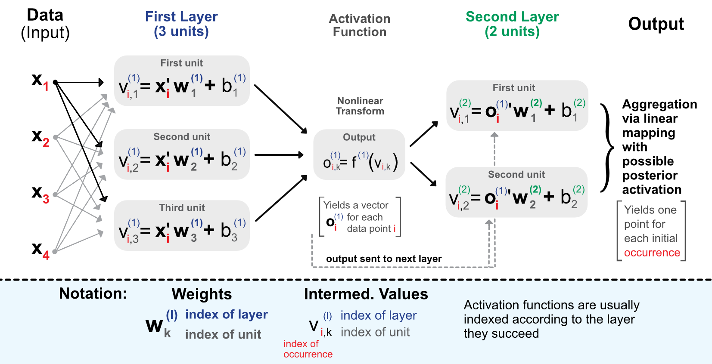
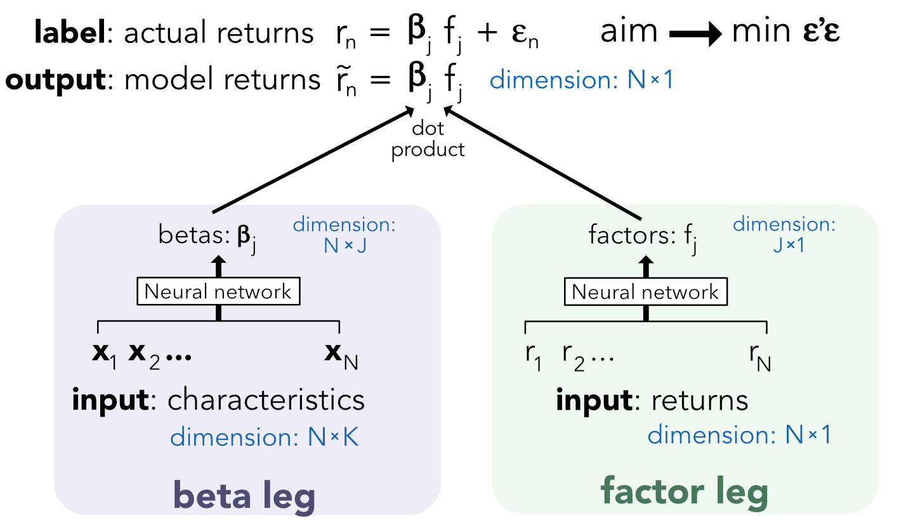

# About - structure of the talk

These slides take a partial hence biased tour across asset pricing models written or published in 2018-2020. We group the papers into three categories:

- **standard/linear models** / **advanced econometrics**;   
- **machine learning**;  
- **theoretical** / **equilibrium-based**.

.font80[To keep up with the **latest trends**, my short list of authors: Alex Chinco .grey[(Illinois Urbana-Champaign)], Bryan Kelly .grey[(Yale / AQR)], and Markus Pelger .grey[(Stanford)] for ML advances and Ralph Koijen .grey[(Chicago)] for more general purpose asset pricing.]

---
# The research problem

.font90[
- Researchers (and practitioners) observe returns on financial markets and seek to **explain them**. Broadly speaking, they aim to understand the causes that drive cross-sectional differences in returns.   
- Sometimes, they are even more ambitious: they try to **predict** them! Obvious reason: **portfolio allocation**.
- Usually, analyses are carried within **asset classes** because the determinants of asset returns are class-dependent (drivers of equities are not the same as those of bonds; same for commodities & crypto-currencies).    
- This talk is focused on **equities** only.  
]

---
# The starting point 


Basically, the goal is to explain **asset returns** $r_{t,i}$, with a focus on the cross-section: $i$ is the index of the asset. The traditional formulation is **linear**:
$$r_{t,i}=\alpha_i + \boldsymbol{\beta}'_i\textbf{f}_t+\epsilon_{t,i},$$
where the $\textbf{f}_t$ are the factors that drive the returns and $\boldsymbol{\beta}_i$ is the vector of **loadings** that quantitatively determine the exposure of the asset to the factors. 

.font80[Most of the papers mentioned in the deck try to link returns with **firms characteristics**. This makes sense empirically: that's where the **data** is. ]

---

class: inverse, center, middle, animated, fadeInRight


<style type="text/css">
.remark-slide-content {
    font-size: 32px;
    padding: 1em 4em 1em 4em;
}
</style>

# Models based on advanced econometrics

---
class: animated, fadeInRight

# Instrumentalized PCA (1/3)
.grey[.font70[**Kelly, Pruitt & Su (JFE 2019)**]]    

The specification is:
$$r_{t+1,i}=\alpha_{t,i}+\boldsymbol{\beta}_{t,i}\textbf{f}_{t+1}+\epsilon_{t+1,i},$$
with $\alpha_{t,i}=\textbf{z}_{t,i}\boldsymbol{\Gamma}_\alpha+\nu_{t,i,\alpha}$ and $\boldsymbol{\beta}_{t,i}=\textbf{z}_{t,i}\boldsymbol{\Gamma}_\beta+\nu_{t,i,\beta}$. 

The central assumption is that factor **loadings** depend on the firm characteristics $\textbf{z}_{t,i}$ (row vector). The **factors** are latent and will be optimized to increase the fit.


---
# Instrumentalized PCA (2/3)

**Estimation method**: minimize squared errors, in stacked notation with $\textbf{Z}_t=[\textbf{1},\textbf{z}_t]$ and $\boldsymbol{\Gamma}=[\boldsymbol{\Gamma}_\alpha,\boldsymbol{\Gamma}_\beta]'$,

$$\underset{\Gamma, \ \textbf{f}_{t+1}}{\min} \ \sum_{t=1}^{T-1}(\textbf{r}_{t+1}-\textbf{Z}_t\boldsymbol{\Gamma}\textbf{f}_{t+1})'(\textbf{r}_{t+1}-\textbf{Z}_t\boldsymbol{\Gamma}\textbf{f}_{t+1})$$
The FOCs imply:
$$\textbf{f}_{t+1}=(\boldsymbol{\Gamma}_\beta' \textbf{Z}_t'\textbf{Z}_t\boldsymbol{\Gamma}_\beta)^{-1}\boldsymbol{\Gamma}_\beta'\textbf{Z}_t'(\textbf{r}_{t+1}-\textbf{Z}_t\boldsymbol{\Gamma}_\alpha)$$
Harder for $\boldsymbol{\Gamma}$ because of **identification** issues $\rightarrow$ see the **paper**!

---
# Instrumentalized PCA (3/3)

**Conclusions**:  

- IPCA "*works better*" compared to FF5 + momentum: same level of fit, but **fewer parameter estimates**. With observed factors, $NK$ estimates are computed, with IPCA, only $K(L+T)$ suffice (factor loadings + factor values);  
- IPCA works also well **out-of-sample**!  
- Some characteristics are more important than other (e.g., **size**). This is seen via loadings when characteristics are **normalized**. 

---
# Pure latent factor models (1/3)

.grey[.font70[**Lettau & Pelger (J Econom. 2020, WP 2020)** ]]    
**Premise**: PCA focuses only on the second moment of the factors (cov. matrix), but first moments matter too!    
$$\textbf{R}=\textbf{F} \times \boldsymbol{\Lambda} + \textbf{e}, \quad \boldsymbol{\Lambda}=\text{loadings}.$$
**PCA**: .font90[focuses on **pure** fit, i.e., solves]   

$$\underset{\textbf{F} , \boldsymbol{\Lambda}}{\text{argmin}} \quad T^{-1} \sum_{n=1}^N\sum_{t=1}^T(R_{t,n}-\textbf{F}_t\boldsymbol{\Lambda}_n)^2,$$

or simply performs PCA on $T^{-1}\textbf{R}'\textbf{R}-\bar{\textbf{R}}\bar{\textbf{R}}'$ .font80[(sample covariance mat.).] 


---
# Pure latent factor models (2/3)

Lettau & Pelger propose an alternative optimization: 


$$\underset{\textbf{F} , \boldsymbol{\Lambda}}{\text{argmin}} \quad \underbrace{T^{-1} \sum_{n=1}^N\sum_{t=1}^T(R_{t,n}-\textbf{F}_t\boldsymbol{\Lambda}_n)^2}_{\text{error in time-series (all terms)}}+\gamma \underbrace{\sum_{n=1}^N(\bar{\textbf{R}}_n-\bar{\textbf{F}}\boldsymbol{\Lambda}_n)^2}_{\text{error in cross-sectional means}},$$
which is equivalent to applying PCA to $T^{-1}\textbf{R}'\textbf{R}+\gamma\bar{\textbf{R}}\bar{\textbf{R}}'$.   
For $\gamma=-1$, we recover the original form, for $\gamma>-1$, sample **means are over-weighted**. 

---
# Pure latent factor models (3/3)

So what? L&P compute the max Sharpe ratio of the tangency portfolio from the mean-variance frontier that is spanned by $\hat{\textbf{F}}$. The weigths are $\hat{\textbf{w}}=\hat{\boldsymbol{\Sigma}}_{\hat{\textbf{F}}}^{-1}\hat{\boldsymbol{\mu}}_\hat{\textbf{F}}$.

Then, they compare the obtained SR, IS & OOS with simple PCA and FF3 factors, as well as pure fit (RMSE). They use several datasets (portfolios & indiv. stock.). 

$\rightarrow$ overall, the evidence is a bit **mixed** (FF3 not too bad!). 

.grey[.font60[For other recent factor models with latent factors, see the recent work of Jianquing Fan & Yuan Liao.]]


---
# The SDF perspective
.bib[
.grey[.font70[**Kozak, Nagel & Santosh (JFE 2019)**]] .font80[propose an estimation of the **SDF**:]
$$\small M_t=1-\textbf{b}'_{t-1}(\textbf{r}_t-\mathbb{E}[\textbf{r}_t]),$$
.font80[with ] $\small \textbf{b}_{t-1}=\textbf{Z}_{t-1}\textbf{b}$.font80[, where ] $\small \textbf{Z}_{t-1}$ .font80[is a matrix of characteristics. Hence factors have form] $\small \textbf{f}_t=\textbf{Z}'_{t-1}\textbf{r}_t$ .font80[and solve the pricing equation] $\small \mathbb{E}[M_t\textbf{f}_t]=0$. .font80[The authors build a **shrinkage estimator** for] $\small \textbf{b}$:
$$\small \hat{\textbf{b}}=(\boldsymbol{\Sigma}+\gamma \textbf{I})^{-1}\bar{\boldsymbol{\mu}},$$
.font80[where] $\small \bar{\boldsymbol{\mu}}$ .font80[is the sample average of the factors and] $\small \boldsymbol{\Sigma}$ .font80[is their *true* cov. matrix.]  .font80[They also use a penalized regression approach to **reduce the number** & magnitude of the estimates.]   
$\rightarrow$ .font80[Performs well only when **at least 8-10 factors** have non-zero betas.]
]

---
# High dimensions conditional models
.bib[
.grey[.font70[**Gagliardini, Ossola & Scaillet (Ecta 2016, WP 2019)**]] $\rightarrow$ .grey[.font70[very general & hard to read!]]   
.font80[Assumptions in the model lead to:]
$$\mathbb{E}[r_{t,a}|\mathcal{F}_{t-1}]=\textbf{b}_{t,a}' \left(\underbrace{\boldsymbol{\nu}_{t}+\mathbb{E}[\textbf{f}_t|\mathcal{F}_{t-1}]}_{\boldsymbol{\lambda}_t=\text{risk premium}}\right), \quad \text{for asset } a,$$
.font80[with in addition] $\boldsymbol{\lambda}_t=\boldsymbol{\Lambda}\textbf{Z}_{t-1}$ .font80[and] $\mathbb{E}[\textbf{f}_t|\mathcal{F}_{t-1}]=\mathbf{F}\textbf{Z}_{t-1}$, $\textbf{Z}_{t-1}$ .font80[being a matrix of instruments (macro. & chars.). The authors propose a weighted 2-pass (à la Fama-MacBeth) estimation procedure and prove the consistency of their estimator of] $\boldsymbol{\lambda}_t$. 
]

---
# Predictive regressions across horizons

Problems arise when the dependent variable and the predictors are **auto-correlated** because stadard econometric assumptions for tests are violated.

- .grey[.font70[Bandi, Perron, Tamoni & Tebaldi (**J. Econom. 2019**):] ] (aggregate) predictability starts by increasing and then decreases with the return horizon (**hump shape**).   
- .grey[.font70[Xu (**RFS 2020**):]] evidence is more mixed. Predictability depends on **predictors**! Div. yield not great, CAY (consumption-wealth ratio) better.


---
# Pockets of predictability
.grey[.font70[**Farmer, Schmidt & Timmermann (WP 2019)**]]

.font90[The authors **dynamically** estimate] $r_{t+1}=\beta x_t+\epsilon_{t+1}$. .font90[The return is the VW portf. of CRSP stocks minus short RF rate. For **predictors**, they use (separately): the div. yield, the yield on 3m TBill, a term spread and a 60d realized variance indicator.]

Using $t$-stats & $R^2$ from rolling $\hat{\beta}_s$, .font90[they characterize the **intensity** and **duration** of periods during which the predictors seem to do their job.] 

$\rightarrow$ .font90[There are lots of **idiosyncrasies**: pockets naturally depend on the predictor, and their length ranges from 40 to 450 days.]


---
# The need for replication
.bib[
.font90[
- Most factors **don't survive** alternative implementations: Harvey, Liu & Zhu **RFS** 2016, McLean & Pontiff **JF** 2016, Linnainmaa & Roberts **RFS** 2018, Hou, Xue & Zhang **RFS** 2020;   
- **Why?** One reason: academic research is plagued with *p*-**hacking**, data snooping, partial reporting, etc. (Harvey JF 2017).     
- Basically, it's easy to obtain a *p*-value of 1% if you run 100 regressions and only publish the best one;    
- Publication **bias**? Not so big! .grey[(surprisingly)] (Chen & Zimmermann **RAPS** 2020)   
- Is it possible to estimate the proportion of **false discoveries/anomalies**? (Harvey & Liu **WP** 2019b, Chordia, Goyal & Saretto **RFS** 2020). What's a reasonable **hurdle** for *t*-stats? $=>$ well above 3! + Need for **multiple tests** (e.g. via bootstrap)!
]]


---
# Replication: notable efforts

```{r, out.width = "600px", echo = F, fig.align='center'}

```

Nowadays: a **REPLICATIONS AND CORRIGENDA** section in the JF!   
.font60[**Ex:** Reassessing False Discoveries in Mutual Fund Performance: Skill, Luck, or Lack of Power? (Vol. 74, Issue 5)]

---
# The anomaly base rate (1/3)
.grey[.font70[**Chinco, Neuhierl & Weber (WP 2019)**]]       
If the $t$-stat of $\hat{\beta}$ is significant, the econometrician is tempted to assume that he/she has found an asset pricing **anomaly**.
That's a short cut because the $p$-value is just one component of the prob.:
$$P[\text{anom.}|\text{signif.}]=\frac{P[\text{signif.} |\text{anom.}]}{P[\text{signif.}]}\times P[\text{anom.}],$$

with 
.font70[
$$P[\text{signif.}]=P[\text{signif.} |\text{anom.}]\times P[\text{anom.}]+\underbrace{P[\text{signif.} |\text{not anom.}]}_{p-\text{value}}\times P[\text{not anom.}]$$]


---
# The anomaly base rate (2/3)
The equation is: 
$$r_n=a^{(k)}+\beta_k x_n^{(k)}+ e_{n}^{(k)}, \quad n= \text{stocks}, \quad k=\text{characteristics}$$
where $x_n$ is standardized in the cross-section. The OLS estimate $\hat{\beta}_k$ can be interpreted as a return on a long-short portfolio built according to the variable $x^{(k)}$ (see Fama 1976 p326!).   
**Assumption**: over all predictive variables $k$, $\beta_k \overset{d}{=}\mathcal{N}(0,\sigma^2)$.   
If $\sigma^2$ is small: there are very few anomalies (predictors are spurious). Hence $\sigma^2$ captures the efficacy of research practices. 


---
# The anomaly base rate (3/3)
.font90[The estimated value of] $\sigma^2$ .font90[is time varying and oscillates around 2.5%.]    
.font90[This can be used to improve predictions. Using AR(3) models to predict betas (] $\small \bar{\beta}^{(k)}$ .font90[= returns) and the corresponding standard errors, the authors build portfolios by removing **weak predictors**, i.e. those with predictions of small magnitude:]
$$\tilde{\beta}_t^{(k)}=\bar{\beta}_t^{(k)} \times \left(1+(\bar{se}_t^{(k)})^2/\bar{\sigma}^2_t\right)^{-1}:$$

.font90[predictions are shrunk proportionally to the confidence in the estimator (measured by the **se**) and then compared to some benchmark value.]   
$\rightarrow$ reported oos returns are .grey[good].


---
# Open questions

.bib[
- the **number** of relevant factors used to be considered small (3-5). Recent contributions show that more are needed to increase precision (.font80[He, Huang & Zhou, (WP 2019), Freyberger, Neuhierl & Weber (RFS 2020); ])   
- **what**'s a factor? .font80[Harvey & Liu (WP 2019a)], .font80[Pukthuanthong, Roll & Subrahmanyam (RFS 2019);]      
- model **competition**: who has the best model? .font80[Chib, Zeng & Zhao (JF 2019)].  Are new factors worth it? .font80[Feng, Giglio & Xiu  (JF 2020);]       
- risk related to **herding** because of packaged factor solutions (ETFs): .font80[DeMiguel, Martin Utrera & Uppal (WP 2019);]   
- **transaction costs**: how to use factor investing to reduce them? .font80[Martin Utrera, DeMiguel, Uppal & Nogales (RFS 2020)]
]

---
class: inverse, center, middle

<style type="text/css">
.remark-slide-content {
    font-size: 32px;
    padding: 1em 4em 1em 4em;
}
</style>

# Models based on machine learning

---
# What is machine learning?

The most common categorization is:

- **unsupervised learning**: try to make sense of $\textbf{X}$ on its own (eg: find clusters);   
- **supervised learning**: try to explain $\textbf{y}$ with a set of predictors $\textbf{X}$;   
- **reinforcement learning**: learn by doing & receiving rewards;   

$\rightarrow$ most papers work with **supervised** methods.

---
# Two families of supervised algorithms (1/2)
**Neural networks**:    
```{r, message=FALSE, warning=FALSE, echo=FALSE, out.width="900px", fig.align='center'}

```


---
# Two families of supervised algorithms (2/2)
**Trees**:    
```{r, message=FALSE, warning=FALSE, echo=FALSE, out.width="530px", fig.align='center'}
knitr::include_graphics("trees.png")
```

.font70[The **best models** (random forests & boosted trees) **aggregate** many trees (ensembles).]

---
# Vanilla SL (1/2)
.grey[.font70[**Gu, Kelly & Xiu (RFS 2020)**]] .font90[use standard supervised learning to predict returns]:
$$r_{t+1,n}=f(\textbf{x}_{t,n})+\epsilon_{t+1,n},$$

.font90[where the predictors] $\textbf{x}_{t,n}$ .font90[are normalized **firm characteristics**, such as market capitalization, accounting ratios, etc. **=>** Similar to **panel** models.]

.font90[It's a **large scope** study: 30,000 stocks, 94 predictors expanded to 846 features via **macro-economic** variables. Models are fit every year. They evaluate 13 models from simple regressions to 5 layer **neural networks**, also spanning penalized regressions and tree methods (**random forests** & **boosted trees**).]
---
# Vanilla SL (2/2)

The results are impressive, both in terms of:   
- **pure fit**, measured by a dedicated $R^2_{\text{oos}}=1-\frac{\sum_{i,t\in \text{oos}}(\tilde{r}_{t,i}-r_{t,i})^2}{\sum_{i,t\in \text{oos}} r_{t,i}^2}$, is often **positive**;      
- **portfolio returns**: stocks are stacked in groups of homogeneous predictions and OOS returns are correctly **ranked**! Some top decile minus bottom decile L/S portfolios reach +**3**% of monthly returns!


---
# Construting ML-based factors (1/2)
.grey[.font70[**Feng, Polson & Xu (2019 WP)**]] 

.font90[Traditionally, factor models are linear but it's possible to add **complexity**:]

$$R_{t,i}=a_i+\boldsymbol{\beta}_i\textbf{f}_t+\boldsymbol{\gamma}_i\textbf{g}_t+e_{t,i},$$
where $\boldsymbol{\beta}_i$ and $\boldsymbol{\gamma}_i$ are loadings, $\textbf{g}_t$ are **traditional** factors (e.g., FF) and $\textbf{f}_t$ are ML-based factors: $\textbf{f}_t=H(\textbf{z}_{t-1})\textbf{r}_t$. $R_{t,i}$ are aggregate (portfolio returns, ex. FF or industry) while $\textbf{r}_t$ are individual stock returns.

$\rightarrow$ .font90[the augmented models] (with $\textbf{f}_t$) .font90[increase OOS fit compared to FF3.]


---
# Construting ML-based factors (2/2)
.grey[.font70[**Bryzgalova, Pelger & Zhu (2019 WP)**]] introduce **asset pricing trees**: portfolios based on customized trees via a dedicated **pruning** method. These serve as factors. Then, they feed these factors to SDF estimators just like .font90[.grey[Kozak, Nagel & Santosh (JFE 2019).] ]  

Naturally, they show that their estimates perform the best in terms of OOS fit and OOS Sharpe Ratio. 


---
# Autoencoders (1/2)
.grey[.font70[**Gu, Kelly & Xiu (J. Econom. 2020)**]]

With simple notations: $\textbf{r}=\textbf{b}'\textbf{f}+\textbf{e}$, with the **loadings** depending on firm characteristics $\textbf{b}=N_b(\textbf{z})$ and **factors** depending on returns $\textbf{f}=N_f(\textbf{r})$, where $N_b$ and $N_f$ are neural networks.

Thus, returns are on both sides of the equation: **circular definition**, the snake eats its tail! 

No problem! **Autoencoders** are here for that: they are a **compression** tool, akin to nonlinear PCA.

---
# Autoencoders (2/2)
```{r, message=FALSE, warning=FALSE, echo=FALSE, out.width="730px", fig.align='center'}

```

Not too hard to code & (again!) reduces OOS errors. 


---
# Generative Adversarial Networks (1/2)
.grey[.font70[**Chen, Pelger & Zhu (2019 WP)**]]   

The authors combine two asset pricing identities $\mathbb{E}_t[M_{t+1}\textbf{R}_{t+1}]=\textbf{0}$ and $M_{t+1}=1-\textbf{w}_t'\textbf{R}_{t+1}$ with a Generalized Method of Moments (**GMM**):
$$\mathbb{E}[M_{t+1}\textbf{R}_{t+1}g(\textbf{I}_t,\textbf{I}_{t,i})]=0,$$

where the conditioning instruments are either firm-specific $\textbf{I}_{t,i}$ or shared $\textbf{I}_t$.

---
# Generative Adversarial Networks (2/2)

The estimation/optimization is the following:

$$\small \underset{w}{\text{min}} \ \underset{g}{\text{max}} \ \sum_{j=1}^N \left\| \mathbb{E} \left[\left(\underbrace{1-\sum_{n=1}^Nw(I_t,I_{t,n})r_{t+1,n}}_{\approx M_t} \right)r_{t+1,j}\underbrace{g(I_t,I_{t,j}}_{\text{Adversary}})\right] \right\|^2$$
two networks compete: $w$ seeks to approximate loadings for the SDF while $g$ tries to **make that hard** for $w$.

$\rightarrow$ great out-of-sample profits!


---
class: inverse, center, middle

<style type="text/css">
.remark-slide-content {
    font-size: 32px;
    padding: 1em 4em 1em 4em;
}
</style>


# Equilibrium-based models

---
# Characteristics-driven demands
.grey[.font70[**Koijen & Yogo (JPE 2019)**]]

.font80[Agents maximize log-utility over terminal wealth:] $\underset{\textbf{w}_{i,t}\ge 0}{\text{max}}\, \mathbb{E}_{i,t}[\log(W_{i,T})]$.
.font80[Beliefs of agents are summarized in the **first two moments** of returns. The latter depend on a polynomial form (with high potentially order) of firm characteristics plus an error term. Characteristics must include market cap. **Key finding:**]
$$\small w_{i,t}(n)\propto\exp\left(\beta_{0,i,t}\text{me}_t(n) +\sum_{k=1}^K\beta_{k,i,t}x_{k,t}(n)+\beta_{K,i,t}\right)$$
$\rightarrow$ factor investing is **optimal**!    
.font60[Agents are indexed by $i$, firms by $n$ and characteristics by $k$.]


---
# Momentum & reversals in equilibrium  
.grey[.font70[**Luo, Subrahmanyam & Titman (RFS 2020)**]] .font90[propose a 3 period model:]
.font90[
- period 1: some agents receive an **early** noisy signal;   
- period 2: some agents receive a **late** noisy signal;  These agents are **overconfident** about their signal and **skeptical** of the signal of the early informed agents;  
- period 3: **liquidation**.   
- uniformed traders serve as **market makers**.    
- all agents have **CARA utility** functions over terminal wealth.
]
.font90[Momentum and reversals are defined by covariances in price changes] $\small (P_t-P_{t-1})$.

---
# Asset pricing in large dimensions
.grey[.font70[**Martin & Nagel (WP 2019)**]]   
.font90[Dividend growth is driven by characteristics:]
$$\Delta \text{y}_t=\textbf{Xg}+\textbf{e}_t, \quad \textbf{e}_t \sim N(\textbf{0},\boldsymbol{\Sigma})$$
The authors study some properties of their model when the number of assets $N$ and characteristics $J$. They show that the in-sample **predictability** of returns in high dimension can only be warranted when $J/N \rightarrow c$, asymptotically. However, predictability **vanishes** out-of-sample.

---
# General equilibrium
.grey[.font70[**Betermier, Calvet & Jo (WP 2019)**]]

The authors propose a **general equilibrium** in an economy with producing (& profit maximizing) firms and a representative agent facing both financial and non-financial risk. In this case, the usual firm attributes (e.g., market & book values and investment) are **endogenous**. 

$\rightarrow$ the model is able to reproduce documented empirical properties related to the **BAB**, **BAC**, **value**, **growth**, **investment** and **profitability** anomalies. 

---
class: inverse, center, middle, animated, fadeInRight

<style type="text/css">
.remark-slide-content {
    font-size: 32px;
    padding: 1em 4em 1em 4em;
}
</style>

# Concluding remarks


---
class: animated, fadeInRight

# Factor irrelevance
.grey[.font70[**Chinco, Hartzman & Sussman (WP 2019)**]] .font80[build an **experiment** with **finance professionals**. They show participants a *"graph depicting both economic growth and cumulative stock returns as well as numeric values for the mean, variance, and correlation between these two time series"*. Then, they ask questions on investments decisions.] .grey[.font60[(Economic growth = proxy for cunsumption growth) ]]

**Conclusion**: .font80[Participants *"invest more in stocks when average stock returns are higher, they invest less in stocks when stock returns are more volatile but, they do not change their demand based on the correlation between stock returns and consumption growth."*]

$\rightarrow$ .font80[what's the point of factors if people **don't care**?]

---


# Takeaways

.bib[
- .font90[There are many **degrees of freedom** when building models that explain the cross-section of returns. It's important to know which ones matter. There is no consensus, except maybe on the fact that studies must be **data intensive**.]     
- .font90[Does model **complexity**/sophistication/technicality increase the odds of publishing in top journals? .grey[Maybe, probably]. Average paper length? LOOOONG.]   
- .font90[Do **nonlinearities** add value? They certainly can increase in-sample fit, but we need **confirmation**.]    
- .font90[Is replication needed? **Definitely**. Sharing data & code is critical. For code, it's relatively easy. data, on the other hand...]

.font90[**Topics** I left out but are trending: **ESG**, **timing**.] ( $\small \rightarrow$ Ask Abraham!)
]

---

<center>
.large[THANK YOU!]
<br>
.blue[What are your questions? ]
</center>

---
class: inverse, center, middle

<style type="text/css">
.remark-slide-content {
    font-size: 32px;
    padding: 1em 4em 1em 4em;
}
</style>

# Bibliography

---
.bib[
.font80[Bandi, Perron, Tamoni & Tebaldi 2019 (**J. Econom.**):] .font60[The scale of predictability]   
.font80[Betermier, Calvet & Jo 2019 (**WP**):] .font60[A supply and demand approach to equity pricing]   
.font80[Bryzgalova, Pelger & Zhu 2019 (**WP**):] .font60[Forest through the trees: Building cross-sections of stock returns]    
.font80[Chen, Pelger & Zhu 2019 (**WP**):] .font60[Deep learning in asset pricing]   
.font80[Chen & Zimmermann 2020 (**RAPS**):] .font60[Publication bias and the cross-section of stock returns]     
.font80[Chib, Zeng & Zhao 2019 (**JF**):] .font60[On comparing asset pricing models]   
.font80[Chinco Neuhierl Weber 2019 (**WP**):] .font60[Estimating the anomaly base rate]   
.font80[Chinco, Hartzman & Sussman 2019 (**WP**):] .font60[Risk-factor irrelevance]   
 
]

---
.bib[
.font80[Chordia, Goyal & Saretto 2020 (**RFS**):] .font60[Anomalies and False Rejections]      
.font80[DeMiguel, Martin Utrera & Uppal 2019 (**WP**):] .font60[What alleviates crowding in factor investing?]    
.font80[Farmer, Schmidt & Timmermann 2019 (**WP**):] .font60[Pockets of predictability]   
.font80[Feng, Polson & Xu 2019 (**WP**):] .font60[Deep Learning in characteristics-sorted factor models]   
.font80[Feng, Giglio & Xiu 2020 (**JF**):] .font60[Taming the factor zoo: A test of new factors]    
.font80[Freyberger, Neuhierl & Weber 2020 (**RFS**):] .font60[Dissecting characteristics nonparametrically]    
.font80[Gagliardini, Ossola & Scaillet 2016 (**Ecta**):] .font60[Time‐varying risk premium in large cross‐sectional equity data sets]   
.font80[Gu, Kelly & Xiu 2020 (**RFS**):] .font60[Empirical asset pricing via machine learning]   

  
]

---
.bib[
.font80[Harvey 2017 (**JF**):] .font60[Presidential address: The scientific outlook in financial economics]    
.font80[Harvey 2019a (**WP**):] .font60[Lucky factors]    
.font80[Harvey 2019b (**WP**):] .font60[False (and missed) discoveries in financial economics]   
.font80[Harvey, Liu & Zhu 2016 (**RFS**):] .font60[… and the cross-section of expected returns]     
.font80[He, Huang & Zhou, 2019 (**WP**):] .font60[New factors wanted: Evidence from a simple specification test.]     
.font80[Hou, Xue & Zhang 2020 (**RFS**):] .font60[Replicating anomalies]     
.font80[Kelly, Pruitt & Su 2019 (**JFE**):] .font60[Characteristics are covariances: A unified model of risk and return]   
.font80[Koijen & Yogo 2019 (**JPE**):] .font60[A demand system approach to asset pricing]    
.font80[Luo, Subrahmanyam & Titman 2020 (**RFS**):] .font60[Momentum and Reversals When Overconfident Investors Underestimate Their Competition]  


]

---
.bib[
.font80[Lettau & Pelger 2020 (**J. Econom.**):] .font60[Estimating latent asset-pricing factors]   
.font80[Lettau & Pelger 2020 (**WP**):] .font60[Factors that fit the time-series and cross-section of stock returns]   
.font80[Linnainmaa & Roberts 2018 (**RFS**):] .font60[The history of the cross-section of stock returns.]   
.font80[Martin & Nagel 2019 (**WP**):] .font60[Market Efficiency in the Age of Big Data]     
.font80[Martin Utrera, DeMiguel, Uppal & Nogales 2020 (**RFS**):] .font60[A transaction-cost perspective on the multitude of firm characteristics]    
.font80[McLean & Pontiff 2016 (**JF**):] .font60[Does academic research destroy stock return predictability?]   
.font80[Pukthuanthong, Roll & Subrahmanyam (**RFS 2019**)] .font60[A Protocol for Factor Identification]   
.font80[Xu (**RFS 2020**):] .font60[Testing for Multiple-Horizon Predictability: Direct Regression Based versus Implication Based]   
]

---
# JF announcement (March 1969)
```{r, out.width = "640px", echo = F, fig.align='center'}

```
