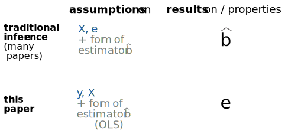
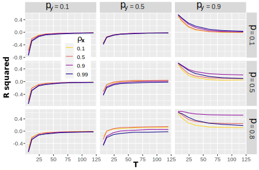
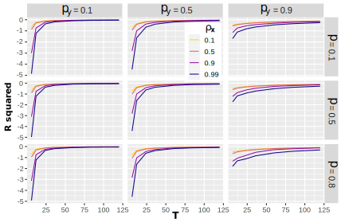
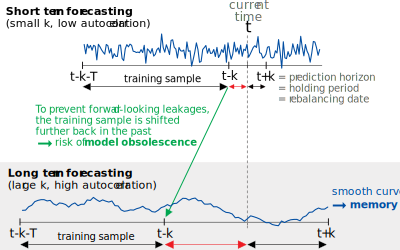
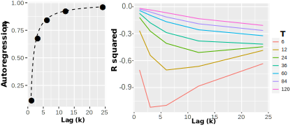
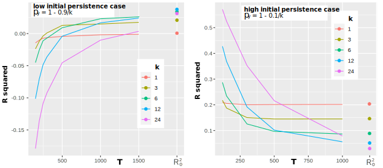
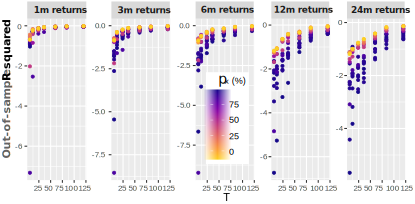
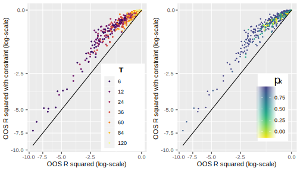
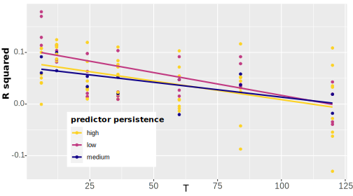

<!-- xaringan::inf_mr() -->

class: inverse, center, middle, animated, fadeInRight


<style type="text/css">
.remark-slide-content {
    font-size: 32px;
    padding: 1em 4em 1em 4em;
}
</style>

# Introduction

---
class: animated, fadeInRight


# PRs: the traditional approach

.font105[
Given two processes $y_t$ and $x_t$, we define as PR the following model:

$$y_{t+k} = a + b x_t + e_{t+k},$$

where both $a$ and $b$ must be estimated (given some sample). We call $k$ the forecasting horizon.

**Traditionally**, assumptions are made on $x_t$ and on the error term, and statistical properties of estimators $\hat{b}$ of $b$ are inferred.
]

---
# The ML setting

Once $(a,b)$ has been estimated, the natural prediction for $y_{t+k}$ is $\tilde{y}_{t+k} = \hat{a}+\hat{b}x_t$ and the usual way to measure its .bluep[**accuracy**] is to compute the (out-of-sample) .bluep[Mean Squared Error] (MSE), or quadratic loss:

$$L = \mathbb{E}\left[(y_{t+k}-\tilde{y}_{t+k})^2\right].$$

Theoretically, this is a hard problem, because even in the simplest (**OLS**) case, the estimator $\hat{b}$ has a pretty intractable expression:
$$\small \hat{b}=\frac{\sum_{s=0}^{T-1}(x_{t-k-s}-\bar{x})(y_{t-s}-\bar{y})}{\sum_{s=0}^{T-1}(x_{t-k-s}-\bar{x})^2} \quad (\text{all terms are random})$$

---
# The simple case

If all parameters are .bluep[**known**], then the loss is minimized by the **optimal slope**:
$$b_o=\frac{\text{cov}(x_t,y_{t+k})}{\text{var}(x_t)}=\rho_y^{k}\frac{\rho\sigma_x\sigma_y}{1-\rho_x\rho_y}\frac{1-\rho_x^2}{\sigma_x^2},$$
in which case $\small L_o=\frac{\sigma_y^2}{1-\rho_y^2}\,\left(1-\rho_y^{2k}\frac{\rho^2}{(1-\rho_x\rho_y)^2}(1-\rho_x^2)(1-\rho_y^2)\right)$ and
$$R^2_o=\rho_y^{2k}\frac{\rho^2}{(1-\rho_x\rho_y)^2}(1-\rho_x^2)(1-\rho_y^2),$$
which increases with $|\rho|$, and is always .bluep[**nonnegative**].


---
# But, in real life...

.font110[Parameters are **unknown**!]


$\rightarrow$ .font110[in practice, the easiest (most common) thing to do is to use the .bluep[**OLS estimator**]. It is the route we take.]    
$\rightarrow$ .font110[however, it is far from obvious that this is an optimal choice.]   
$\rightarrow$ .font110[in fact, extensive testing would show that it can lead to negative (out-of-sample)] $R^2$ !


---
# The assumptions

In the paper, we assume that both $x$ and $y$ are **AR**(1) **processes**:
\begin{align}
x_{t+1} &= \alpha_x + \rho_x x_t +e_{x,t+1},
\label{eq:ar_x}\\
y_{t+1} &= \alpha_y + \rho_y y_t +e_{y,t+1},
\label{eq:ar_y}     
\end{align}
with constants $\alpha_x$ and $\alpha_y$, autocorrelations $\rho_x$ and $\rho_y$ satisfying $|\rho_x|<1$ and $|\rho_y|<1$, and **correlated Gaussian white noise processes** $e_{x}$ and $e_{y}$ with variances $\sigma_x^2$ and $\sigma_y^2$ and correlation $\rho$ satisfying $|\rho|<1$.

These hypotheses are .bluep[rather common] in the literature.

---
# A few references on PRs


.bib[
.font80[
- .bluep[**Stambaugh JFE 1999**]: sample estimates are biased when $x$ is persistent   
- .bluep[**Bandi et al. J. Econom 2019**]: predictability attains its peak around 12-15Y   
- Extensions of Stambaugh (panel & multivariate): 
 * .bluep[**Amihud & Hurvich JFQA 2004**], 
 * .bluep[**Hjalmarrson FRL 2008**], 
 * .bluep[**Andersen & Varneskov J. Econom 2020**]    
- Long horizon estimates are skewed by construction: 
 * .bluep[**Valkanov JFE 2003**], 
 * .bluep[**Boudoukh et al. RFS 2008**]      
- Efficient tests for inference: 
 * .bluep[**Campbell & Yogo JFE 2006**], 
 * .bluep[**Jonhson RAPS 2019**], 
 * .bluep[**Xu RFS 2020**]

]
]

---
# In short 

    
```{r, message=FALSE, warning=FALSE, echo=FALSE, out.width="960px", fig.align='center'}

```


---
# Our research question

.font120[**When is it a good idea to use the OLS estimator in predictive regressions?**] (i.e. when is $R^2>0$?)

The (complicated) answer depends on the .bluep[**model parameters**]:
- $k$, the horizon of the forecast;   
- $T$*, the sample size;    
- $\rho_x$, $\rho_y$: the autocorrelations;    
- $\rho$: the (cross-)correlation in innovations.   
- $\alpha_x$, $\alpha_y$, $\sigma_x^2$, $\sigma_y^2$... ?


---

class: inverse, center, middle, animated, fadeInRight


<style type="text/css">
.remark-slide-content {
    font-size: 32px;
    padding: 1em 4em 1em 4em;
}
</style>

# Theoretical results


---
# Simple facts

The loss (mean squared error) has the following .bluep[**properties**]:   

- it does not depend on the constants of the processes $\alpha_x$ & $\alpha_y$;   
- it does not depend on $\sigma_x^2$, the variance of innovations of $x$;      
- it is **proportional** to $\sigma_y^2$, the variance of innovations of $y$;    
- it is **symmetric** in $\rho$, the correlation between the two innovation processes.

Moreover, if means are known, $\rho=0$ and $\rho_x=\rho_y$, then we can show that **short term forecasting is more accurate**, i.e., that

$$L(k+1) > L(k), \quad k \ge 1 .$$


---
# Analytical forms

The loss can be written

$$L=\sigma_y^2 \left(v_y +  \int_0^\infty |\boldsymbol{\Delta}| \, \left(  t \, f_2(t)-2f_1(t)\right) dt \right),$$
where $v_y$ is a simple variance term related to $y_t$. The matrix $\boldsymbol{\Delta}$ and the functions $f_1$ and $f_2$ depend on $k$ (horizon), on $T$ (sample size) and on the correlation parameters ( $\rho_x$, $\rho_x$ and $\rho$) in a very non-trivial fashion.


---
# Sensitivity: 1 month horizon forecasting

   
```{r, message=FALSE, warning=FALSE, echo=FALSE, out.width="680px", fig.align='center'}

```


.font80[Big change for **high persistence** in *y* (right column, $L_o$ not the best!).   
Persistence in *x* matters less.]


---
# Sensitivity: 12 month horizon forecasting

   
```{r, message=FALSE, warning=FALSE, echo=FALSE, out.width="700px", fig.align='center'}

```

.font85[In all cases, **long samples** are preferable.]


---
# The memory tradeoff (1/2)

**Best combo**: low $k$, high $\rho_y$. In practice: not that easy!

```{r, message=FALSE, warning=FALSE, echo=FALSE, out.width="700px", fig.align='center'}

```


---
# The memory tradeoff (2/2)

Illustration on the US **equity premium** (S&P 500 minus TBill).

```{r, message=FALSE, warning=FALSE, echo=FALSE, out.width="800px", fig.align='center'}

```

**Model obsolescence** seems to outweigh persistence gains.


---
# Convergence towards $b_o$ and $R^2_o$

As $T$ increases, the loss/ $R^2$ converges to some limiting value: it's the **theoretical optimum** (OLS)! Again, **persistence ** is key!

```{r, message=FALSE, warning=FALSE, echo=FALSE, out.width="840px", fig.align='center'}

```


---

class: inverse, center, middle, animated, fadeInRight


<style type="text/css">
.remark-slide-content {
    font-size: 32px;
    padding: 1em 4em 1em 4em;
}
</style>

# Empirical confirmation


---
# Data

We work on the *Welch & Goyal* (2008) dataset (updated through Dec. 2019) + a temperature variable from *Novy-Marx* (2014).

Predictors include aggregate **dividend-price** ratio, **book-to-market** ratio, **earnings-price** ratio, **stock variance**, etc. + some variations thereof. We categorize them in 3 groups of **persistence** (low, medium, high).

The dependent variable is the US Equity premium, with **horizons** of 1, 3, 6, 12 and 24 months.

---
# The impact of persistence

Low persistence in predictors works better. But still, $R^2<0$!

```{r, message=FALSE, warning=FALSE, echo=FALSE, out.width="890px", fig.align='center'}

```


---
# Economic constraints

.font80[The equity premium is **positive** (most often): cut the negative part of predictions!]

```{r, message=FALSE, warning=FALSE, echo=FALSE, out.width="800px", fig.align='center'}

```

---
# Portfolio timing

.font90[A signal that aggregates individual predictors. Sharpe ratios (TC adj.):]

```{r, message = F, warning = F, echo = FALSE, out.width=9}
library(tidyverse)
library(kableExtra)
library(gt)
load("port_res.RData")
port_res %>% 
    filter(indicator == "SR") %>%
    select(-indicator) %>%
    mutate(Horizon = paste0(y, "M"), .before = 2 ) %>% 
    ungroup() %>%
    dplyr::select(-y) %>%
    bind_cols(SP500 = c(0.054, 0.091, 0.132, 0.189, 0.270)) %>% 
  # gt(rowname_col = "y", groupname_col = FALSE) %>%
  # tab_spanner(label = "Sample size", columns = 2:8, gather = TRUE) %>%
  # tab_spanner(label = "Horizon", columns = 1, gather = FALSE) %>%
  # fmt_number(2:8, decimals = 3) %>%
  # fmt_number(1, decimals = 0, suffixing = TRUE) %>%
  # opt_row_striping() %>%
  kbl(digits = 3) %>%
  kable_paper("hover", full_width = T, html_font = "Cambria") %>%
  kable_styling(bootstrap_options = "striped", font_size = 18) %>%
  kable_material(c("striped", "hover")) %>%
  column_spec(8, bold = T) %>%
  column_spec(9, bold = T) %>%
  add_header_above(c("y" = 1, "Sample Size (months)" = 7, "Bench." = 1))

```


---
# Forecasting variance

This is easier ( $R^2>0$). Low samples work better.

```{r, message=FALSE, warning=FALSE, echo=FALSE, out.width="800px", fig.align='center'}

```


---
# Conclusion

.font110[
1. The OOS **accuracy** of predictive regressions depends on some key parameters.    
2. The most important are sample size (T), forecasting horizon (k), and persistence of the dependent variable).   
3. The best results are obtained for small k and high persistence (e.g.: short-term volatility).   
4. If k is large, then the best hope is to reach the optimal loss, which is achieved with **very large samples**. 
]
The paper's **webpage**: http://www.gcoqueret.com/PRs.html
---

class: inverse, center, middle, animated, fadeInRight


<style type="text/css">
.remark-slide-content {
    font-size: 32px;
    padding: 1em 4em 1em 4em;
}
</style>

# Thank you for your attention!


---

# Q&A
  <br> <br> <br>
.font180[  What are your questions? ]