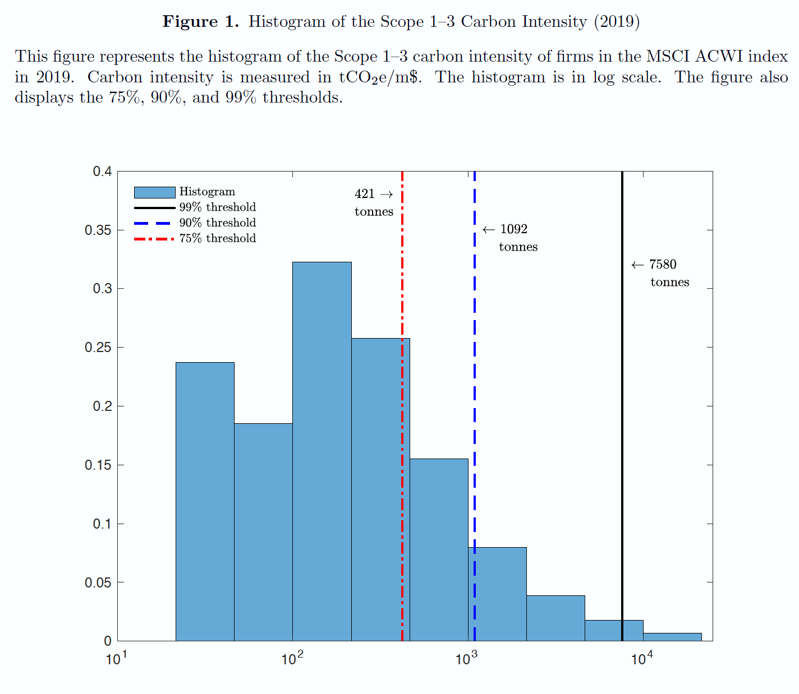

<!-- xaringan::inf_mr() -->

```{r, warning = F, message = F, echo = F}
library(tidyverse)
library(lubridate)
library(ggthemes)
library(xaringanthemer)
# <!-- , animated, fadeInRight -->
```


class: inverse, center, middle


<style type="text/css">
.remark-slide-content {
font-size: 32px;
padding: 1em 4em 1em 4em;
}
</style>


# Introduction


---
# Context

<div style="width: 100%;float: bottom;margin-top:-20px;margin-bottom: 50px;"> 
.font90[The demand for .green[green assets] has **soared**. .font80[.grey[(Morningstar data below)] ]] 

<div style="width: 100%;float: bottom;margin-top:-20px;margin-bottom: 50px;"> 

.bib[
```{r, message=FALSE, warning=FALSE, echo=FALSE, out.width="1050", fig.align='right'}

```
]
<div style="width: 100%;float: bottom;margin-top:-20px;margin-bottom: 50px;"> 

... .font80[which may have driven green **returns**: see [van der Beck (2021)](https://papers.ssrn.com/sol3/papers.cfm?abstract_id=3929359) - and [Gabaix & Koijen (2021)](https://papers.ssrn.com/sol3/papers.cfm?abstract_id=3686935) more generally.]

<div style="width: 100%;float: bottom;margin-top:-20px;margin-bottom: 50px;"> 

$\rightarrow$ .font80[**issues remain**: cost of sustainability, implementation leeway, greenwashing?]

---
# The problem(s)

.font90[**Portfolio choice** seeks to determine optimal allocation between assets and requires "DOC" inputs from the investor:]  
- .font80[**data**: returns, usual characteristics (for factors), ESG features: .font90[.grey[used for estimation purposes (e.g., expected returns, covariance matrix,] .green[greenness].grey[, etc.)]]]  
- .font80[the **objective** (utility function): preference with respect to risk, greenness]   
- .font80[some **constraints**] .font70[.grey[(liquidity, factor/geographical/sector exposure, leverage, etc.)]]     


<div style="width: 100%;float: bottom;margin-top:-20px;margin-bottom: 50px;"> 

--

.font80[In the end:]

<div style="width: 100%;float: bottom;margin-top:-20px;margin-bottom: 50px;"> 

$$\small w^*=f(D,O,C)$$

.font80[In practice, portfolios can be (very) sensitive to these three groups of choices.]

---

class: inverse, center, middle


<style type="text/css">
.remark-slide-content {
font-size: 32px;
padding: 1em 4em 1em 4em;
}
</style>


# First issue: data

---
# ESG disagreement

<div style="width: 100%;float: bottom;margin-top:-20px;margin-bottom: 50px;"> 


.font80[Raters have different **sources** & **methodologies**, which]  .font80[generate potentially large discrepancies in their assessments. This is widely documented:]

<div style="width: 100%;float: bottom;margin-top:-20px;margin-bottom: 50px;"> 

--

.font80[
[Dimson, Marsh, Staunton (2020)](https://jpm.pm-research.com/content/47/1/75), [Avramov, Cheng, Lioui & Tarelli (2021)](https://papers.ssrn.com/sol3/papers.cfm?abstract_id=3711218)    
[Gibson, Krueger & Schmidt (2021)](https://papers.ssrn.com/sol3/papers.cfm?abstract_id=3433728) & [Berg, Kolbel, Rigobon (2022)](https://papers.ssrn.com/sol3/papers.cfm?abstract_id=3438533):
]

--

<div style="width: 100%;float: bottom;margin-top:-20px;margin-bottom: 50px;"> 


```{r, message=FALSE, warning=FALSE, echo=FALSE, out.width="890", fig.align='right'}

```

<div style="width: 100%;float: bottom;margin-top:-20px;margin-bottom: 50px;"> 

--


$\rightarrow$ .font80[**confusing** for asset managers: which to use, how to average?]

---
# Which metrics to use?

<div style="width: 100%;float: bottom;margin-top:-20px;margin-bottom: 50px;"> 


.font80[[Le Guenedal & Roncalli (2021)](https://papers.ssrn.com/sol3/papers.cfm?abstract_id=3999971): *Portfolio Construction with Climate Risk Measures*]   

.font90[What's the best **proxy** for greenness?] 

<div style="width: 100%;float: bottom;margin-top:-20px;margin-bottom: 50px;"> 

--

.pull-left[
- .font80[current] $\small \text{CO}_2$ .font80[/ GHG emissions] $\rightarrow$ .font80[**size bias**]  
- .font80[emission **intensities** (emissions divided by revenue or mkt. cap.)]  $\rightarrow$ .font80[hard to average]  
- .font80[**pathways**] $\rightarrow$ .font80[require models & estimations for firms-specific trends:]
]    
 


--
.pull-right[
```{r, message=FALSE, warning=FALSE, echo=FALSE, out.width="690"}

```
]


$\rightarrow$ .font80[reliable **Scope 3** time-series are short! Extrapolation can be hard/risky.]

---
# The cross-section of extrapolations

<div style="width: 100%;float: bottom;margin-top:-20px;margin-bottom: 50px;"> 

.font90[Very much trending upwards! Hard to sustain...]

<div style="width: 100%;float: bottom;margin-top:-20px;margin-bottom: 50px;"> 

```{r, message=FALSE, warning=FALSE, echo=FALSE, out.width="660", fig.align='center'}

```

---
# Other risk metrics... & approaches

- sensitivity to **carbon taxes** (default à la Merton) 
- exposure to a long-short *carbon* portfolio ( $\beta$)
- vulnerability to climate events / **disasters**   

Other facets:  
- .green[**opportunities**] (avoided .brown[emissions], .green[green] revenues from patents)   
- aggregation (scoring, weighted averages, etc.)

---

class: inverse, center, middle


<style type="text/css">
.remark-slide-content {
font-size: 32px;
padding: 1em 4em 1em 4em;
}
</style>


# Second issue: objectives & constraints

```{r, echo = F, eval = F}
---
# Two options:

- **heuristic** approaches: best-in-class vs. worst-in-class assets $\rightarrow$ inclusion / exclusion  
- **sophisticated** methods: **optimization**! Via utility, constraints, etc. 
```


---
# "Simple" benchmarks (1/2)

<div style="width: 100%;float: bottom;margin-top:-20px;margin-bottom: 50px;"> 

.font80[[Jondeau, Mojon & Pereira da Silva (2021)](https://papers.ssrn.com/sol3/papers.cfm?abstract_id=3987186): *Building Benchmarks Portfolios with Decreasing Carbon Footprints*]

.pull-left[
.font90[**Starting point**: emission intensities are not uniformly distributed across firms:]

.font90[**Issue**: sector & geographical tilts. But **benchmarks** require traditional exposures!]
]
--
.pull-right[
```{r, message=FALSE, warning=FALSE, echo=FALSE, out.width="650"}

```
]


---
# "Simple" benchmarks (2/2)

<div style="width: 100%;float: bottom;margin-top:-30px;margin-bottom: 50px;"> 


.font80[**Targeted Reinvestment**] $\rightarrow$ .font80[smart approach, **BUT**:]   
<div style="width: 100%;float: bottom;margin-top:-35px;margin-bottom: 50px;"> 
- .font80[does the world need to stick to **business as usual** (!) benchmarks?]   
- .font80[is it desirable to maintain sector tilts? Why maintain .brown[**inertia**]?] .font80[If anchoring is so important, then maybe we need **new** .green[benchmarks].]  
- .font70[Passive investing made the cap-weighted indices the anchors, but ETFs can change that] $\rightarrow$ .font70[new **framing** for practitioners & academics. Why not be more ambitious: ]

<div style="width: 100%;float: bottom;margin-top:-25px;margin-bottom: 50px;"> 

```{r, message=FALSE, warning=FALSE, echo=FALSE, out.width="750", fig.align='center'}

```

<div style="width: 100%;float: bottom;margin-top:-25px;margin-bottom: 50px;"> 


---
# What's the limit?

<div style="width: 100%;float: bottom;margin-top:-20px;margin-bottom: 50px;"> 

.font90[=> How far can we go without hurting performance .grey[(significantly)]?]   


<div style="width: 100%;float: bottom;margin-top:-20px;margin-bottom: 50px;">   

.pull-left[
[.font80[Pedersen, Fitzgibbons & Pomorski JFE 2020]](https://papers.ssrn.com/sol3/papers.cfm?abstract_id=3466417): .font80[the **ESG** efficient frontier] 
```{r, message=FALSE, warning=FALSE, echo=FALSE, out.width="600", fig.align='center'}

```
]

.pull-right[
<div style="width: 100%;float: bottom;margin-top:150px;margin-bottom: 50px;"> 
.font90[There seems to be a .bluen[sweet] spot.]  
But here: overall .bluen[**ESG**] &  
ESG $\neq$ Emissions   
<div style="width: 100%;float: bottom;margin-top:60px;margin-bottom: 50px;"> 
It's likely this remains true for .brown[**emissions**]...
]

---
# Back to optimization

<div style="width: 100%;float: bottom;margin-top:-30px;margin-bottom: 50px;"> 

.font80[[Le Guenedal & Roncalli (2021)](https://papers.ssrn.com/sol3/papers.cfm?abstract_id=3999971) propose a penalized quadratic optimization scheme with particular **constraints**. The agent is endowed with a .brown[**brown**] footprint that she wants to reduce by a factor] $\small \mathcal{R}$:   
<div style="width: 100%;float: bottom;margin-top:-20px;margin-bottom: 50px;"> 
.font80[
- focused on turnover, volatility / tracking error (.brown[**benchmarks**] again!)   
- accomodates for any footprint metric & many constraints:
]

<div style="width: 100%;float: bottom;margin-top:-20px;margin-bottom: 50px;"> 

```{r, message=FALSE, warning=FALSE, echo=FALSE, out.width="690", fig.align='center'}
knitr::include_graphics("eq.png")
```


---
# But, in short 

<div style="width: 100%;float: bottom;margin-top:-20px;margin-bottom: 50px;"> 

.font70[With this machinery, you can control & fine tune everything... except **uncertainty**! **Estimation** versus .bluen[realization], **in-sample** versus .bluen[out-of-sample] performance.]

<div style="width: 100%;float: bottom;margin-top:10px;margin-bottom: 50px;"> 

.font70[
| Indicator (firm) | Short term prediction (1Y-5Y) | Long term prediction (10Y+) |
| --- |:---:|:---:|
| Return  | Hard  | Hard  |   
| Volatility / correlations | So so | So so |  
| Emissions / intensities | Easy  | So so |  
]

<div style="width: 100%;float: bottom;margin-top:-20px;margin-bottom: 50px;"> 

.font80[**Question**: how can we build reliable long-term granular emission forecasts?] .font70[Pathways, trajectories: not enough chronological depth? NLP, scrapping annual reports?]   

.font80[Moreover, meta-meta analyses suggest that, on the long run, greenness is not related to average realized returns. Hence, it should suffice to optimize on .bluen[risk] and .green[sustainability]. (whereas in MPT, it's risk vs return) ]


---
# Open research questions

Preferences drive demand; demand drives .bluen[**AUM**]...

.bib[
```{r, message=FALSE, warning=FALSE, echo=FALSE, out.width="890", fig.align='center'}
knitr::include_graphics("conclusion.svg")
```
]

.font90[**Question**: what's the .grey[(actual/aggregate?)] **appetite** for greenness and how can we calibrate these trade-offs? ]  

---
# Thank you!

**Going further**:   
- [Perspectives in sustainable equity investing](http://www.esgperspectives.com)   
- [Thierry Roncalli's course on sustainable finance](http://www.thierry-roncalli.com/SustainableFinance.html)

<div style="width: 100%;float: bottom;margin-top:100px;margin-bottom: 50px;"> 

 
.center[
.font180[Time for **Q&A**!]]


---
# Bibliography

.bib[.font60[
- [Avramov, Cheng, Lioui & Tarelli 2021](https://papers.ssrn.com/sol3/papers.cfm?abstract_id=3711218): *Sustainable investing with ESG rating uncertainty*
- [Berg, Kolbel, Rigobon 2022](https://papers.ssrn.com/sol3/papers.cfm?abstract_id=3438533): *Aggregate Confusion: The Divergence of ESG Ratings*  
- [Berk & van Binsbergen 2021](https://papers.ssrn.com/sol3/papers.cfm?abstract_id=3909166): *The impact of impact investors*   
- [Coqueret & Vu 2022](https://papers.ssrn.com/sol3/papers.cfm?abstract_id=4002705): *ESG news spillovers to (and from) the supply chain*   
- [Derrien, Krüger,  Landier & Yao 2021](https://papers.ssrn.com/sol3/papers.cfm?abstract_id=3903274): *ESG news, future cash flows, and firm value*    
- [Dimson, Marsh, Staunton 2020](https://jpm.pm-research.com/content/47/1/75): *Divergent ESG Ratings*   
- [Gabaix & Koijen 2021](https://papers.ssrn.com/sol3/papers.cfm?abstract_id=3686935): *In search of the origins of financial fluctuations: The inelastic markets hypothesis*   
- [Gibson, Krueger & Schmidt 2021](https://papers.ssrn.com/sol3/papers.cfm?abstract_id=3433728) : *ESG Rating Disagreement and Stock Returns*    
- [Jondeau, Mojon & Pereira da Silva 2021](https://papers.ssrn.com/sol3/papers.cfm?abstract_id=3987186): *Building Benchmarks Portfolios with Decreasing Carbon Footprints*    
- [Koijen & Yogo 2020](https://papers.ssrn.com/sol3/papers.cfm?abstract_id=2537559): *A Demand System Approach to Asset Pricing*    
- [Le Guenedal & Roncalli 2021](https://papers.ssrn.com/sol3/papers.cfm?abstract_id=3999971): *Portfolio Construction with Climate Risk Measures*   
- [Lioui & Tarelli 2021](https://papers.ssrn.com/sol3/papers.cfm?abstract_id=3878314): *Chasing the ESG factor*  
- [Pastor, Stambaugh & Taylor 2020](https://papers.ssrn.com/sol3/papers.cfm?abstract_id=3498354): *Sustainable investing in equilibrium*  
- [Pastor, Stambaugh & Taylor 2021](https://papers.ssrn.com/sol3/papers.cfm?abstract_id=3864502): *Dissecting green returns*  
- [Pedersen, Fitzgibbons & Pomorski JFE 2020](https://papers.ssrn.com/sol3/papers.cfm?abstract_id=3466417): *Responsible Investing: The ESG-Efficient Frontier*    
- [Sautner, van Lent, Vilkov & Zhang 2021](https://papers.ssrn.com/sol3/papers.cfm?abstract_id=3642508): *Firm-level Climate Change Exposure*   
- [van der Beck 2021](https://papers.ssrn.com/sol3/papers.cfm?abstract_id=3929359): *Flow-Driven ESG Returns*   
]
]