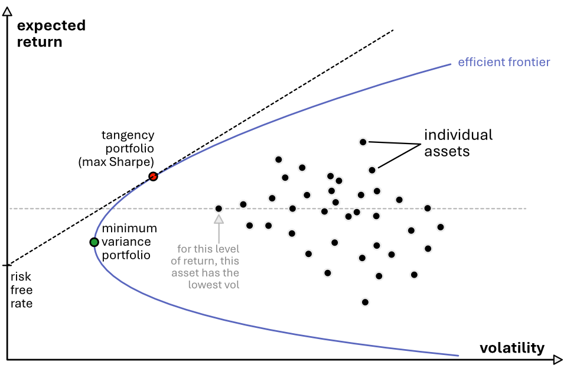
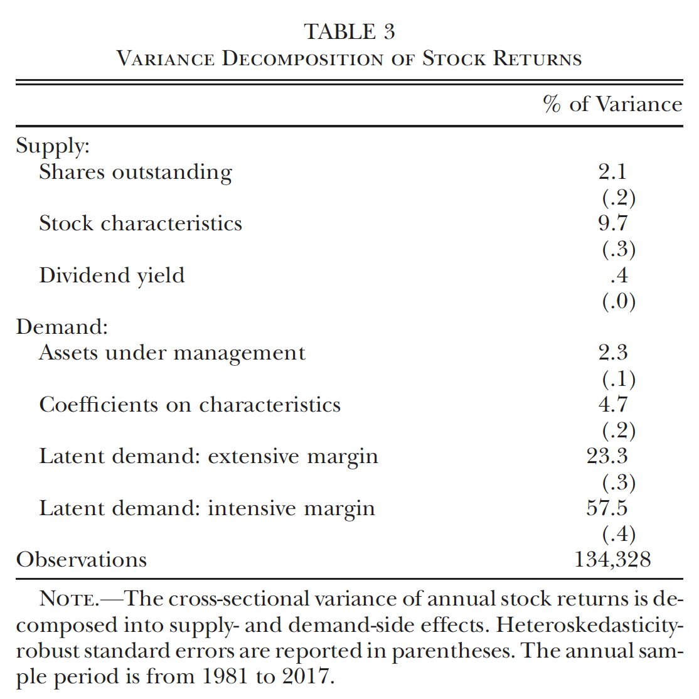
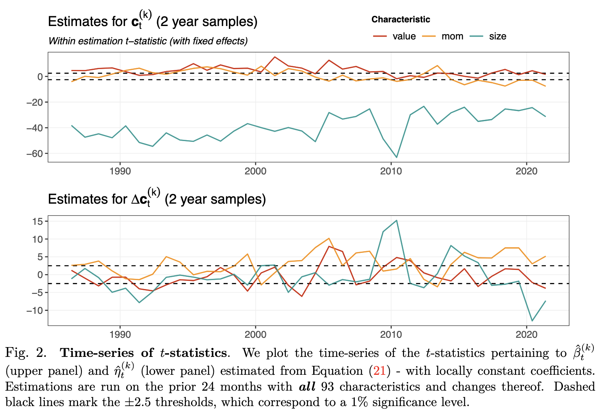
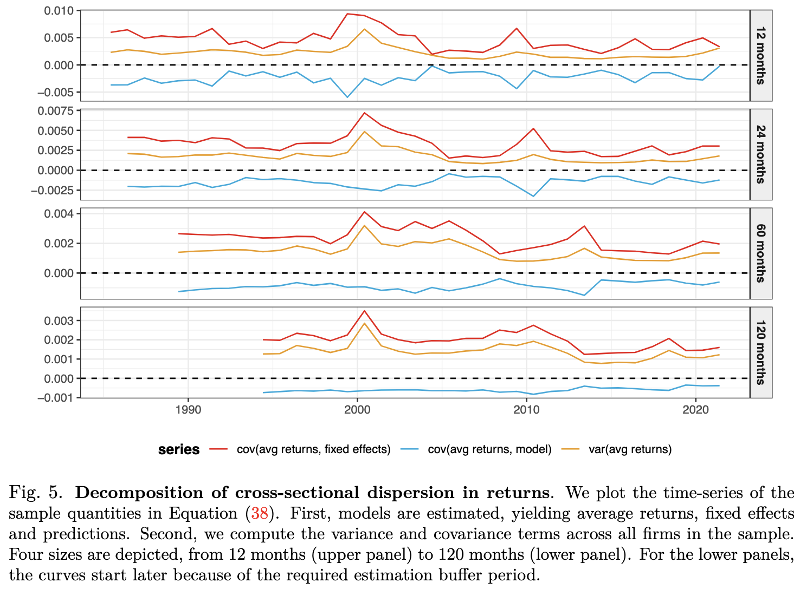

```{css, echo=FALSE}
.my_class {
font-size: 0.8em;
}
```


**NOTE**: The present notebook is coded in R. It relies heavily on the [**tidyverse**](https://www.tidyverse.org/) ecosystem of packages. We load the tidyverse below as a prerequisite for the rest of the notebook - along with a few other libraries. 

$\rightarrow$ Don't forget that code flows **sequentially**. A random chunk may not work if the previous have have not been executed. 

```{r}
#| message: false
#| warning: false
#| class-source: my_class
#| classes: my_class
library(tidyverse)   # Package for data wrangling
library(readxl)      # Package to import MS Excel files
library(latex2exp)   # Package for LaTeX expressions
library(quantmod)    # Package for stock data extraction
library(highcharter) # Package for reactive plots
```


# Context

We have not talked about macro finance until now. One important reference is exactly [**Macro Finance**](https://academic.oup.com/rof/article/21/3/945/3060346) by Cochrane. It reviews many models, most of which are based on the Euler formula $\mathbb{E}[M_tR_t]=0$, where $R_t$ is an excess return and $M_t$ is a so-called [**stochastic discount factor**](https://en.wikipedia.org/wiki/Stochastic_discount_factor). Cochrane mentions several sub-streams of the literature that invoke various concepts, such as **habits**, **disaster**, **long-term risks**, **heterogeneous preferences**, etc.


# A demand-based model

Here, rather, we follow another route. We present the ideas of [**A Demand System Approach to Asset Pricing**](https://www.journals.uchicago.edu/doi/full/10.1086/701683). 

## A primer on mean-variance choice

In Finance, since the seminal contribution of Markowitz, the paradigm for **portfolio choice** is that of **mean versus variance**. Anyone should seek to minimize variance for a given level of average return, or, equivalently, to maximize the return for a given amount of risk. 

In financial terms, this can be written as:
$$w^* = \underset{w}{\text{argmax}} \ \left\{ \underbrace{w'\mu}_{\text{average}} - \frac{\gamma}{2}  \underbrace{w' \Sigma w}_{\text{variance}}  \right\},$$
where $\gamma$ is the **risk aversion** parameter: the higher it is, the more the focus is set on **minimizing risk**. The above expression can be viewed as a maximization of expected utility.  

Now, there is an additional constraint on $w$: it should sum to one because most investors can only invest the money can have (i.e., 100% of it) - not more; and usually not less as well (sub-optimal). Some institutions, like hedge funds, can use short-selling to benefit from leverage, but this can lead to risky positions. 

Hence, we seek to solve 
$$w^* = \underset{w}{\text{argmax}} \ \left\{ w'\mu - \frac{\gamma}{2}  w' \Sigma w \right\}, \quad s.t. \ w'1=1$$
where vectors are used whenever it is obvious, as in $w'1=1$: the first 1 is a *vector*. The **Lagrangian** is

$$L(w)=w'\mu - \frac{\gamma}{2}  w' \Sigma w + \lambda(w'1=1)$$
so

$$\frac{\partial L}{\partial w}=\mu - \gamma \Sigma w+\lambda 1=0 \quad \Leftrightarrow \quad w^*= \gamma^{-1} \Sigma^{-1}(\mu + \lambda 1),$$ {#eq-MV}
and $\lambda$ is chosen so that the **budget constraint is saturated**. Note that the two components are well-known: $\Sigma^{-1}\mu$ is (proportional to) the portfolio that maximizes the Sharpe ratio whereas $\Sigma^{-1}1$ is the minimum variance allocation (up to a scaling factor). 

We see these two portfolios on the diagram below (green and red dots).



Now, the problem of all of this is that the estimation of $\mu$ and $\Sigma$ is a **VERY** difficult task, in particular for $\mu$. Indeed, returns change a lot, whether it be realized returns, expected returns, etc. Using *past returns* to forecast or estimate $\mu$ is usually a bad idea...

An additional problem is the the optimal weights $w^*$ often imply negative positions, which is not desirable most of the time. In addition, investors have many constraints: geographical or industry exposure, diversification, liquidity and trading costs, etc. In short, the mean-variance approach, in its most simple formulation, is seldom put in practice.     


## Information from characteristics

In the era of information and big data, we have access to a lot of characteristics for firms. These include:   

- **past prices and returns**, possibly at a high frequency;    
- **sentiment**: aggregate feeling towards the firm based on recent news and social media feeds;   
- **accounting information**: valuation, debt, earnings, profitability, etc. (+ ownership);    
- **sustainability**: corporate performance on the ESG dimensions

The latter two are usually disclosed at low frequency (quarterly at best), but nowcasting can decrease latency...

## The model

The whole point here is that it can make sense to assume that characteristics contain valuable information that can help estimate $\mu$ and $\Sigma$. One important result from Koijen & Yogo (2019) is a formalization of the fact that an optimal portfolio can be obtained this way. The trick here is to consider a slightly different definition of utility, namely when any agent on the market follows the following rule:

$$w^*_i = \underset{w_i}{\max} \ \mathbb{E}[\log(A_{i,T})]$$

This requires some notation for which we follow the original paper closely. Assets are indexed by $n$, investors by $i$ and time by $t$. Prices, dividends, market equity and shares (supply) are $P_t(n)$, $D_t(n)$, $ME_t(n)$ and $S_t(n)$. Gross returns are $R_t(n)=(P_t(n)+D_t(n))/P_{t-1}(n)$. We then use lowercase for logarithmic quantities: $p_t$ is the **vector** of $\log(P_t(n))$ (across all $n$). 


The evolution of wealth follows:

$$A_{i,t+1}=A_{i,t}\left(R_{t+1}(0) + \textbf{w}_{i,t}(\textbf{R}_{t+1}- R_{t+1}(0) \textbf{1}) \right)$$

where the index $0$ refers to some outside asset (e.g., investors removing their money from the market). It is possible to add constraints on holdings. For instance:  

- $\textbf{w}_{i,t}\ge 0$, which is called "*no short selling*". Normal agents cannot sell assets they do not posess.   
- $\textbf{1}'\textbf{w}_{i,t}<1$: the agent cannot spend more than it has. 

The Lagrangian is then

$$L_{i,t}=\mathbb{E}_{i,t}\left[\log(A_{i,t+1}) + \Lambda_{i,t}\textbf{w}_{i,t}+\lambda_{i,t}(1-\textbf{1}'\textbf{w}_{i,t}) \right].$$

## Some solutions


An approximate solution of this problem is 

$$\textbf{w}_{i,t}=\boldsymbol{\Sigma}_{i,t}^{-1}(\boldsymbol{\mu}_{i,t}-\lambda_{i,t}\textbf{1}),$$
where $\boldsymbol{\Sigma}_{i,t}$ and $\boldsymbol{\mu}_{i,t}$ are the covariance matrix and expected returns of the asset (for which the shortsale constraint is not binding). This is very similar to the form of @eq-MV!!!

Now, these inputs are notoriously hard to estimate and moreover, investors now make decisions based on **firm characteristics**, such as accounting figures, past performance, risk measures, non-financial metrics (ESG), market sentiment, etc..

Let us now assume that $\textbf{x}_{i,t}(n)$ encapsulates the information of stock $n$ known to investor $i$. In practice it is easier to consider public information that is known to everyone - but sometimes, alternative data providers can sell *special* information to its customer, e.g., based on satelitte imagery, credit card logs, internet mining, etc. In particular, one information that is always available for publicly traded companies is their **size**, captured by **market equity** (ME) in the model. 

Moreover, we write $\textbf{y}_{i,t}(n)$ for a more complex form of $\textbf{x}_{i,t}(n)$ that includes possible non-linear transforms and interaction effects. This makes the investor more sophisticated and the model more general. 

In the sequel, we further posit that expected returns and covariance matrices depend on these vectors:

\begin{align}
\boldsymbol{\mu}_{i,t}(n) &= \textbf{y}_{i,t}(n)' \boldsymbol{\Phi}_{i,t} + \phi_{i,t} \\
\boldsymbol{\Sigma}_{i,t}(n) &= \boldsymbol{\Gamma}_{i,t}(n) \boldsymbol{\Gamma}_{i,t}(n)'+\gamma_{i,t} \textbf{I} \\
\boldsymbol{\Gamma}_{i,t}(n)&= \textbf{y}_{i,t}(n)' \boldsymbol{\Psi}_{i,t} + \psi_{i,t} 
\end{align}

An important result of [Koijen & Yogo](https://www.journals.uchicago.edu/doi/abs/10.1086/701683) is then that the optimal portfolio can be expressed as follows:

$$\frac{w_{i,t}(n)}{w_{i,t}(0)}=\exp \left(\beta_{0,i,t} \text{me}_{i}(n) +\sum_{k=1}^{K-1}\beta_{k,i,t}x_{k,t}(n) + \beta_{K,i,t} \right)\epsilon_{i,t}(n)$$
Hence, even though investors have log-preferences that translate in mean-variance optinmization; because the moments of excess returns are driven by the characteristics, it is them who end up **driving demand**. Note that the 0$^{th}$ characteristics is always market equity and the $K^{th}$ one is a common constant. Lastly, $\epsilon_{i,t}$ measured the portion of demand that is not captured by the characteristics; it is called the **latent demand**.

Finally, in the model, **market clearing** equates demand and supply, which is written **\textbf{S}** and assumed constant for simplicity. Total market equity for each firm is (summed over all participants in the market):
$$\text{ME}_{t}(n)=\sum_{i=1}^IA_{i,t}w_{i,t}(n).$$

If we take the logs, this translates to
$$\textbf{p}=\textbf{f}(\textbf{p})=\log \left(\sum_{i=1}^IA_i\textbf{w}_i(\textbf{p}) \right)-\textbf{s},$$
where the subtlety is that of course the log-price **p** impacts the demand **w**.

Under a mild technical assumption on the $\beta_{0,i}$, [Koijen & Yogo](https://www.journals.uchicago.edu/doi/abs/10.1086/701683) show that $\textbf{f}$ has a unique fixed point in $\mathbb{R}^N$.


# The noise in characteristics

One important issue with the above model is that it relies on and requires holdings to verify its results. Data can be found, especially for institutional investors, but it will always paint an incomplete picutre, as there will be many stock holders/traders that will not be covered. 


## Model

Here, we start directly with market clearing (demand and supply):

$$
\textbf{d}_t(\textbf{p}_t) = \textbf{s}_t(\textbf{p}_t),
$$ {#eq-clear0}


where the vectors of aggregate demands $\textbf{d}_t$ and supplies $\textbf{s}_t$ depend on the vector of prices $\textbf{p}_t$. To ease the calculations, it is customary to model the demand side only. One rationale for this choice is that researchers prefer to investigate the impact of the demand side on asset prices. Often, investors are separated into heterogeneous groups. One group will craft its allocation decisions based on preferences as well as on some information set, including the price of the asset, while the other group is considered as market maker (liquidity provider, the right side of @eq-clear0 ). The equation then becomes
\begin{equation}
\textbf{d}_t(\textbf{p}_t) = \textbf{s}_t \quad \Longrightarrow \quad \textbf{p}_t = \textbf{d}_t^{-1}(\textbf{s}_t),
\label{eq:clear1}
\end{equation}
where the implication only holds when the inverse (multivariate) mapping $\textbf{d}_t^{-1}$ is well-defined. Going into further detail, the total demand function $\textbf{d}_t$ can be broken down if we consider heterogeneity in the demand of agents, in which case, 
\begin{equation}
\sum_{i=1}^IA_{t,i}\textbf{w}_{t,i}(\textbf{p}_t) = \textbf{s}_t,
\label{eq:clear2}
\end{equation}


where $A_{t,i}$ is the time-$t$ wealth of agent $i$ that is invested on the market and $\textbf{w}_{t,i}$ is the corresponding relative buy or sell quantities (strictly speaking they are not necessarily portfolio compositions and we discuss this nuance later on). One favorable case is when this demand form can be factorized into:

$$
\left(\sum_{i=1}^IA_{t,i}\textbf{w}_{t,i}\right)(\textbf{p}_t) = \textbf{s}_t  \quad \Longrightarrow \quad\textbf{p}_t =  \left(\sum_{i=1}^IA_{t,i}\textbf{w}_{t,i}\right)^{-1}(\textbf{s}_t  ),
$$ {#eq-clear3}

where, again, the implication only holds if the inverse makes sense. The factorization can occur when $\textbf{w}_{t,i}$ is separable, i.e., $\textbf{w}_{t,i}=w_i \times \textbf{w}_t(\textbf{p}_t)$, or when the price-driven part is linear, that is, when $\textbf{w}_{t,i}=a_{t,i,n}+b_{t,i}\textbf{p}_t$. Under reasonable assumptions, the $b_{t,i}$ in the latter form is supposed to be negative, because demand usually decreases with price (the empirical evidence is mixed on this point).


The main issues with most theoretical models is that they yield *prices* and not *returns*. If we want to obtain returns from  @eq-clear3, we must tackle the following expressions (logarithmic versus arithmetic returns):
\begin{align}
\textbf{r}_{t+1}&=\log \left(\text{diag}\left( \left(\sum_{i=1}^IA_{t,i}\textbf{w}_{t,i}\right)^{-1}(\textbf{s}_t  ) \right)^{-1}  \left(\sum_{i=1}^IA_{t+1,i}\textbf{w}_{t+1,i}\right)^{-1}(\textbf{s}_{t+1}  )\right), \quad \text{or} \\
 \textbf{r}_{t+1}&  =\text{diag}\left( \left(\sum_{i=1}^IA_{t,i}\textbf{w}_{t,i}\right)^{-1}(\textbf{s}_t  ) \right)^{-1}  \left(\sum_{i=1}^IA_{t+1,i}\textbf{w}_{t+1,i}\right)^{-1}(\textbf{s}_{t+1}  )-1,
\label{eq:ret0}
\end{align}
where diag$(\textbf{v})$ fills a diagonal matrix with the values of vector $\textbf{v}$. The two expressions above are impractical to work with in all generality. It is therefore imperative to impose a strong structure on the agent demands $\textbf{w}_{t,i}$ to obtain tractable formulae for returns. This is the purpose of the next section. Closed-form expressions are not necessary for empirical applications as long as prices or returns can easily be evaluated numerically (as is done in [Koijen & Yogo](https://www.journals.uchicago.edu/doi/abs/10.1086/701683)). Nonetheless, they often offer insightful interpretations. 


Next, as before, we  assume agents allocate according to firms' characteristics, which we write $c_{t,n}^{(k)}$. 

One central hypothesis of the model is that the weights (or demands) $\textbf{w}_t$ are unconstrained and can be negative. For instance, this can correspond to the case where market clearing operates on **net** demands. Markets and agents would be assumed to be mature so that, at each time step, the latter *adjust* their portfolio by fine-tuning pre-existing positions. 

We work with the general form
$$
w_{t,i,n}=a_{t,i,n}+ b_{t,i}^{(0)}f(p_{t,n})+ g_{t,i}(\textbf{c}_{t-1,n}),
$$ {#eq-demand0}

The above demand is expressed as a percentage of investor $i$'s wealth, i.e., it can be considered as a portfolio composition, even though we do not impose that it sums to one across all $N$ firms. 

We recall that market clearing imposes that for each asset, total net demand matches total net supply, i.e.,
$$
\sum_{i=1}^I A_{t,i} w_{t,i,n} = s_{t,n}.
$$ {#eq-clear6}

The most important assumption of the model is the separation, in the demand, between the *log*-price and the other characteristics, which are unrelated to the former. **Market clearing** implies

$$
\sum_{i=1}^I A_{t,i}\left( a_{t,i,n}+ b_{t,i}^{(0)}\log(p_{t,n}) + g_{t,i}(\textbf{c}_{t-1,n})\right)= s_{t,n},
$$ {#eq-dem0}

i.e., 

$$
\log(p_{t,n})=\frac{\overbrace{\sum_{i=1}^I A_{t,i} \left(a_{t,i,n}+ g_{t,i}(\textbf{c}_{t-1,n}) \right)}^{\text{total non-price related demand}}-\overbrace{s_{t,n}}^{\text{supply}}}{-\underbrace{\sum_{i=1}^IA_{t,i}b_{t,i}^{(0)}}_{\text{agg. demand for log-price}}} .
$$

It seems reasonable to assume that the denominator $-\sum_{i=1}^IA_{t,i}b_{t,i}^{(0)}$ is positive, because we expect prices to decrease with supply. This amounts to posit that the aggregate demand for log-prices is negative, which is an intuitive postulate.

Then,

\begin{align}
r_{t+1,n}&=\log\left(\frac{p_{t+1,n}}{p_{t,n}}\right)  \nonumber \\
&=\frac{\sum_{i=1}^I A_{t+1,i} \left(a_{t+1,i,n}+g_{t+1,i}(\textbf{c}_{t,n})\right)-s_{t+1,n}}{\kappa_{t+1}} -\frac{\sum_{i=1}^I A_{t,i} \left(a_{t,i,n}+g_{t,i}(\textbf{c}_{t-1,n})\right)-s_{t,n}}{\kappa_t}  \nonumber\\
&=\sum_{i=1}^I B_{t+1,i} \left(a_{t+1,i,n}+g_{t+1,i}(\textbf{c}_{t,n})\right)- \sum_{i=1}^I B_{t,i} \left(a_{t,i,n}+g_{t,i}(\textbf{c}_{t-1,n})\right)+   \frac{s_{t,n}}{\kappa_{t}}-\frac{s_{t+1,n}}{\kappa_{t+1}}  \\
&\small =\underbrace{\underbrace{\sum_{i=1}^I (B_{t+1,i} a_{t+1,i,n}-B_{t,i}a_{t,i,n})}_{\substack{\text{change in scaled} \\ \text{ non-characteristic demand}}} + \underbrace{\sum_{i=1}^I (B_{t+1,i} g_{t+1,i}(\textbf{c}_{t,n})-B_{t,i}g_{t,i}(\textbf{c}_{t-1,n}))}_{\substack{\text{change in scaled} \\ \text{ pure characteristic demand}}}}_{{g}^*(\textbf{c}_{t,n}, \textbf{c}_{t-1,n})}+ \underbrace{ \underbrace{ \frac{s_{t,n}}{\kappa_{t}}-\frac{s_{t+1,n}}{\kappa_{t+1}} }_{\text{supply shock}}}_{e_{t+1,n}} 
\end{align}
where $\kappa_t=-\sum_{i=1}^IA_{t,i}b_{t,i}^{(0)}>0$ is minus the aggregate demand for the log price and $B_{t,i}=A_{t,i}/\kappa_t$ are the scaled wealths. In short:

$$r_{t+1,n}= {g}^*(\textbf{c}_{t,n}, \textbf{c}_{t-1,n})+ e_{t+1,n}.$$  {#eq-center}

## The case of linear demands

In this case, the expression is simply:
$$
g_{t,i}(\textbf{c}_{t-1,n})=a_{t,i,n}+\sum_{k=0}^K  b_{t,i}^{(k)} c_{t-1,n}^{(k) },
$$ {#eq-lindem}
where the constants $b_{t,i}^{(k)}$ determine the sign and appetite intensity of agent $i$ for characteristic $k$. For the sake of consistency with @eq-demand0, characteristic zero in the above specification is the log-price.


We can then prove the following result (not entirely straightforward).

::: {.callout-note}
## Lemma

If agent $i$ believes that returns are driven by 
$$
\textbf{r}_{t+1}=\textbf{C}_t\boldsymbol{\beta}_{t+1,i}+ \textbf{e}_{t+1},
$$ {#eq-ass}

then the optimal budget-constrained **mean-variance portfolio** weight for asset $n$ can be written as

$$
\textbf{w}^*_{t,i,n}= f_{i,n,1}+\sum_{k=0}^Kc_{t,n}^{(k)}\times f_{i,n,2}, 
$$ {#eq-f0}
where $f_{i,n,1}:=f_{i,n,1}(\textbf{C}_t,\hat{\boldsymbol{\beta}}_{t,i},\hat{\boldsymbol{\Sigma}}_{\boldsymbol{\beta},i}, \hat{\boldsymbol{\sigma}}_{e,i}^2)$ and $f_{i,n,2}:=f_{i,n,2}(\textbf{C}_t,\hat{\boldsymbol{\beta}}_{t,i},\hat{\boldsymbol{\Sigma}}_{\boldsymbol{\beta},i}, \hat{\boldsymbol{\sigma}}_{e,i}^2)$ are scalars that depend on the data $\textbf{C}_t$, as well on agent $i$'s estimations for the terms in @eq-ass.
:::


Moreover, the demand form @eq-lindem allows to change the notation and include the $a_{t,i,n}$ terms in the sum, so that the linearized form of @eq-center now reads 
$$
r_{t+1,n} =\sum_{i=1}^I\left(B_{t+1,i}a_{t+1,i,n}-B_{t,i}a_{t,i,n}+ \sum_{k=1}^{K} \left( B_{t+1,i}  b_{t+1,i}^{(k)} c_{t,n}^{(k) }   -  B_{t,i}  b_{t,i}^{(k)} c_{t-1,n}^{(k) } \right)\right) + \varepsilon_{t+1,n},
$$
where
$$
\varepsilon_{t+1,n}=\frac{s_{t,n}}{\eta_{t}}-\frac{s_{t+1,n}}{\eta_{t+1}} 
$$ {#eq-charfree}
is the innovation from the supply-side. We can then swap the two sums (in $i$ and $k$) in the central term and, for a given $k$, we can decompose the central shift in two ways, depending one the factors we put forward:

$$
\sum_{i=1}^I \left(c_{t,n}^{(k) } B_{t+1,i} b_{t+1,i}^{(k)}-c_{t-1,n}^{(k) }B_{t,i} b_{t,i}^{(k)}\right) 
$$ 

$$
=  c_{t,n}^{(k)} \underbrace{\sum_{i=1}^I \left( B_{t+1,i}b_{t+1,i}^{(k)}- B_{t,i}b_{t,i}^{(k)}\right)}_{\beta^{(k)}_{t+1}=\, \text{change in scaled agg. demand}} + \underbrace{\left(c_{t,n}^{(k)} -c_{t-1,n}^{(k)}\right)}_{\text{past change in char.}} \underbrace{\sum_{i=1}^I B_{t,i}b_{t,i}^{(k)}}_{\eta^{(k)}_t= \, \text{past demand}} \ (\text{first identity}) 
$$
$$=  \ \eta_{t+1}^{(k)}(c_{t,n}^{(k)}-c_{t-1,n}^{(k)}) + c_{t-1,n}^{(k)}\beta_t^{(k)} \quad (\text{second identity}) $$ {#eq-def7}


In the end, we obtain the following result. 

::: {.callout-note}
## Lemma

We assume that market clearing is defined in @eq-clear6 and demands satisfy @eq-demand0 and @eq-lindem. In partial equilibrium, it holds that,
\begin{align}
r_{t+1,n}&=\alpha_{t+1,n} + \sum_{k=1}^{K} \left(\beta_{t+1}^{(k)}c_{t,n}^{(k)} + \eta_t^{(k)}\Delta c_{t,n}^{(k)} \right) + \varepsilon_{t+1,n}, \quad \text{or} \label{eq:simple} \\ 
r_{t+1,n}&=\alpha_{t+1,n} + \sum_{k=1}^{K} \left(\beta_{t}^{(k)}c_{t-1,n}^{(k)} + \eta_{t+1}^{(k)}\Delta c_{t,n}^{(k)} \right) + \varepsilon_{t+1,n}, \label{eq:simpl2}
\end{align}
where $\Delta c_{t,n}^{(k)}=c_{t,n}^{(k)} -c_{t-1,n}^{(k)}$ is the local change in the characteristic, $\beta_{t}^{(k)}$ is the change in scaled aggregate demand for characteristic $k$, and $\eta_{t}^{(k)}$ is the scaled demand for characteristic $k$ defined in @eq-def7. Innovations terms $\varepsilon_{t+1,n}$ come from the supply side and are given in @eq-charfree. Finally, the stock-specific constant is the change in aggregate scaled demand that is not driven by characteristics: $\alpha_{t+1,n}=\sum_{i=1}^I(B_{t+1,i}a_{t+1,i,n}-B_{t,i}a_{t,i,n})$.

:::


# What the data says


In the original paper, [Koijen & Yogo](https://www.journals.uchicago.edu/doi/abs/10.1086/701683) decompose stock variance into several components, including the variance of **latent demand** (split in two depending on whether it relates to changes in the set of stocks (extensive margin) or simply the composition of the allocation (intensive margin)). Clearly, latent demand makes up for a significant portion of variance (80%+), much much more than characteristics...

{width=300, fig-align="center"}


Turning to the returns-based approach, we run **rolling regressions** inspired from the second lemma and plot the time-varying $t$-statistics. We do so for 93 characteristics, but only plot the outcome (for the $\beta$, not the $\eta$) for the 3 most common ones. 





We can also decompose the variance of returns as


$$
\begin{align}
\sigma_r^2=
    \underbrace{\quad \mathbb{C}\text{ov}[\bar{r}_n,\bar{r}_n] \quad }_{\substack{}}&=\mathbb{C}\text{ov}[\bar{r}_n, \hat{\alpha}_n+\bar{f}(\textbf{x}_n)]  \\  
    \begin{array}{c} \, \text{variation in} \\ \text{mean returns} \end{array}&=\underbrace{\, \mathbb{C}\text{ov}[\bar{r}_n,\hat{\alpha}_n]}_{\text{covariance with effects}} \ + \ \underbrace{\, \mathbb{C}\text{ov}[\bar{r}_n, \bar{f}(\textbf{x}_n)]}_{\text{covariance with char. model}}.
    \label{eq:dec2}
\end{align}
$$

This is again proof that characteristics do not explain a very large portion of **return variation**...





$\rightarrow$ researchers in asset pricing still have a lot of work to do!


