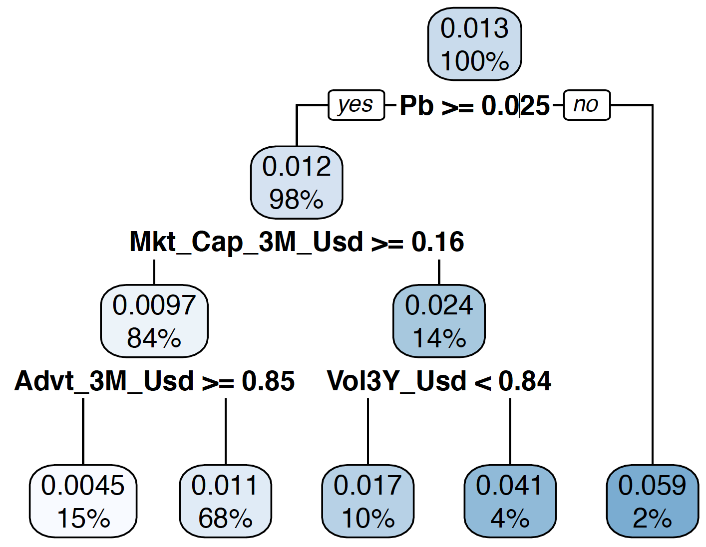

<!-- xaringan::inf_mr() -->

```{r setup, include=FALSE}
options(htmltools.dir.version = FALSE)
knitr::opts_chunk$set(warning = FALSE, message = FALSE)
```

class: inverse, center, middle, animated, fadeInRight


<style type="text/css">
.remark-slide-content {
    font-size: 32px;
    padding: 1em 4em 1em 4em;
}
</style>

# About

---
class: animated, fadeInRight


# About - structure of the talk

These slides take a partial hence biased tour across applications of AI in financial fields.    
The presentation is split in two:

- **overview by discipline** (credit scoring, fraud detection, asset management)*;   
<!-- - **focus on ML-guided investing**;  -->
- **required toolkit** (tips on where to focus & what to learn) & **illustrations**.


*.font90[.grey[AI is also pervasive in fields related to finance (chatbots, clustering for CRM, etc. - for banks, insurances companies, funds).]]

---

class: inverse, center, middle, animated, fadeInRight


<style type="text/css">
.remark-slide-content {
    font-size: 32px;
    padding: 1em 4em 1em 4em;
}
</style>

# Thematic overview: Credit Scoring

---
# ML for credit scoring: introduction

.font90[The **context**: you are a financial institution and you want (need?) to lend money to an **individual** or a **company**.]

.font90[The traditional method is to study the .red[**profile**] of the entity asking for the loan and to devise a procedure that determines the conditions (usually the **rate** - though it can be much more complicated)]

.font90[The important word is .red[**profile**]. Why? Because this is where the data is.]   

* .font80[For **individuals**: age, salary, wealth, other loans, default history, FICO score, etc.]   
* .font80[For **companies**: all accounting data (revenue, debt, financial ratios, etc.)]


---
# ML for credit scoring: data

The **idea**: process this data automatically to determine some key feature of the loan (ex: the rate).
.font80[**Ex:** www.kaggle.com/c/GiveMeSomeCredit .grey[(**warning**: need to log to access data)]]

.font80[**Sample criteria**:
- Person experienced 90 days past due delinquency or worse   
- Total balance on credit cards and personal lines of credit except real estate    
- Age of borrower in years    
- Number of times borrower has been 30-59 days past due but no worse in the last 2 years    
- Monthly debt payments, alimony, living costs divided by monthy gross income   
- Monthly income   
- Number of times borrower has been 90 days or more past due
]

---
# ML for credit scoring: data

Roughly ~100K lines (not yet in big data territory!)

```{r, message=FALSE, warning=FALSE, echo=FALSE, out.width="770", fig.align='center'}

```

.font90[=> translate all of this in a **probability of default** (or other metric)!]


---
# ML for credit scoring: process


```{r, message=FALSE, warning=FALSE, echo=FALSE, out.width="770", fig.align='center'}

```

=> translate all of this in a **probability of default** (or other metric)!


---
# ML for credit scoring: issues & challenges

- **bias**: a major point of criticism comes from the possible unwanted (and unknown) biases that result from algorithmic recommendation. What if gender or race play a role when we would not want them to? .font90[.grey[Related example: Apple Pay gender scandal on credit limits.]]    
- **interpretability** & **explainability**: the black-boxing of the decision process is .red[scary]. An important question is: why did the algorithm take this decision? (e.g., what are the key criteria?) Luckily, more tools are available that "white-box" the results so that lay people can understand the groundings of ML outcomes. => ML must remain a decision **tool**, not a decision agent.


---

class: inverse, center, middle, animated, fadeInRight


<style type="text/css">
.remark-slide-content {
    font-size: 32px;
    padding: 1em 4em 1em 4em;
}
</style>

# Thematic overview: Fraud Detection

---
# ML for fraud detection: introduction

.font110[There are (at least) two types of financial frauds:]

- Pretty obvious (& common): you are a bank & facing risk of fraudulent use of **credit cards** or **hacking**. This makes your customers unhappy `r emo::ji("rage")`. So you try to fight against that.    
- Less common: **reporting fraud**. Voluntarily or not, firms produce accounting/admin documents with errors. This is bad too, for other reasons. 


---
# ML for transaction fraud detection

.font80[.grey[Kaggle also features these kinds of tasks:     
https://www.kaggle.com/mlg-ulb/creditcardfraud
]]


.column[.font70[

Again, the principle is the same: rely on **data**!    
Each transaction has characteristics:     
- **client info** (age, education, account balance, location, recent transaction history, etc.),   
- **transaction type** (credit card, online purchase, etc.),    
- **transation location** (obvious!),    
- **transaction amount**,    
- etc.

]
]

.pull.right[ 
```{r, message=FALSE, warning=FALSE, echo=FALSE, out.width="320", fig.align='right'}

```
]


---
# ML for reporting fraud detection

In this case, the approach is slightly different.

Of course, it is always possible to use .grey[past data] (i.e., previous reports) for comparison purposes.

One other solution is to resort to **textual analysis** (simple text mining (like number frequencies), or more elaborate Natural Language Processing tools).


---
# Issues

.font120[
**Fewer ethical concerns** - because fighting against fraud seems .bluep[legit]!

**Technical obstacles**: highly unbalanced data! Very few frauds overall, this makes them hard to spot. The interesting parts of datasets are highly concentrated.
]


---

class: inverse, center, middle, animated, fadeInRight


<style type="text/css">
.remark-slide-content {
    font-size: 32px;
    padding: 1em 4em 1em 4em;
}
</style>

# Thematic overview: Does AI help make money?

---
class: animated, fadeInRight

# The big picture

Nowadays, we have access to **lots** of information. Some is public, much is private.   

Data is a **business** (=> ex: data providers like Bloomberg or Thomson Reuters).    

So again: is it possible to take advantage of large amounts of data & make money out of it?

Fama (2013 Nobel Prize recipient) says: nope because all information is already priced in the market. .red[The market is impossible to beat!]


---
# .font90[Data: what are we talking about? The playing field]

.font110[
- **firm-specific** traditional data: accounting ratios, price patterns, risk measurements, etc.     
- **firm-specific** alternative data: sentiment (computed in real time via NLP / social media)  
- **asset-specific** high frequency data (equities, FX, futures, cryptocurrencies)   
- **macro-economic now-casting**: forecasting aggregate quantities before they are released (ex: credit card log analysis, satellite imagery)   
]

Some details in my book: www.mlfactor.com

---
# People like complexity

```{r, message=FALSE, warning=FALSE, echo=FALSE, out.width="990", fig.align='center'}

```


---
# Issues

.font140[
- making money? .bluep[**ESG**] investing? Using ML towards .bluep[sustainable] finance?   
- **time-varying** environments.    
- backtest .red[**overfitting**].   
- trust: again, people don't blindly give money to **black boxes**.

]

---

class: inverse, center, middle, animated, fadeInRight


<style type="text/css">
.remark-slide-content {
    font-size: 32px;
    padding: 1em 4em 1em 4em;
}
</style>

# Which skillset?

---
class: animated, fadeInRight

# Domain expertise vs data science dichotomy

Often, people view machine learning like a **philosopher's stone**: whatever is touched by it turns in gold.
**Why**? Because **sophistication** impresses.

But this is incredibly .red[**wrong**]. Give the best ML engineer in the world a problem he knows nothing about, and nothing magical will happen.

**Expertise** in a domain is required to reach great results. Data science alone does not suffice.

---
# About sophistication

.font110[
It's only valuable if it makes **sense**.   

In machine learning, people learn from the .bluep[**past**] to predict the .bluep[**future**].

But of course, it's ** very very hard** to find out which part of the past (if any) is representative of the future.  

Technically, ML is only useful when the testing set is "*close*" to the training set.
]

---
# What is the minimum requirement?

.font100[
**Level 0**: simple stats .font90[(distributions)], Excel   
**Level 1**: advanced stats .font90[(regression)], simple use R/Python, dataviz   
**Level 2**: good notions in optim., penalized reg., simple NN, tree methods, intermediate R/Python   
**Level 3**: Bayesian stats, causality, deep learning, adv. trees, simple NLP, interpretability   
**Level 4**: Adv. NLP, production of ML pipeline, models trained on GPU/TPU 
]
.font90[More importantly: **practice** & **communicate** (ex: on Kaggle competitions)]

---
# Programming libraries

```{r, message=FALSE, warning=FALSE, echo=FALSE, out.width="990px", fig.align='center'}

```

$+$ many **domain specific** packages! .font80[.grey[(sorry, Julia & Matlab)]]   
But again: coding blindly will only get you so far...


---
# AI & asset management: illustration
**Trees** are great for visualization. Below, we explain returns.    
```{r, message=FALSE, warning=FALSE, echo=FALSE, out.width="530px", fig.align='center'}

```

.font70[The **best models** (random forests & boosted trees) **aggregate** many trees (ensembles).]


---
# Credit scoring: a visual example

Take the **credit scoring** database. We seek to explain the probability of default by customers' characteristics.  

```{r, warning = F, message = F, echo = F, fig.align='center', out.width="600px", out.height="490px"}
library(tidyverse)
library(readxl)
library(rpart)
library(rpart.plot)
set.seed(42)

cs_training <- read_csv("cs-training.csv")
sampleEntry <- read_csv("sampleEntry.csv")
colnames(cs_training) <- c("Id", "serious_dlqin2yrs", "revolv_utiliz", "age", "nb_3059_pastdue",	"debt_ratio", "income", "open_cred_lines", "nb_90days_late", "nb_loans", "nb_3989_pastdue", "nb_dependents")
data <- cs_training %>%
    left_join(sampleEntry, by = "Id") %>%
    na.omit()

winsore <- function(v,a){
    b <- quantile(v,a)
    d <- quantile(v,1-a)
    v[v<b] <- b
    v[v>d] <- d
    v
}
data <- data %>% mutate_at(2:12, winsore, a = 0.01)
fit <- rpart(Probability ~ . , data = data %>% select(-Id), cp = 0.00001, maxdepth = 3)
rpart.plot(fit)
```


---
# Credit scoring: interpretability with breakdown

```{r, warning = F, message = F, echo = F, fig.align='center', out.width="600px"}
library(breakDown)
library(randomForest)
fit <- randomForest(Probability ~ ., 
                 data = data %>% select(-Id),  
                 sampsize = 5000,           # Size of (random) sample for each tree
                 replace = FALSE,           # Is the sampling done with replacement?
                 nodesize = 250,            # Minimum size of terminal cluster
                 ntree = 12,                # Nb of random trees
                 mtry = 5                   # Nb of predictive variables for each tree
    )
explain_break <- broken(fit, 
                        data[42,] %>% select(-Id),
                        data = data %>% select(-Id))
plot(explain_break) 
```


---

class: inverse, center, middle, animated, fadeInRight


<style type="text/css">
.remark-slide-content {
    font-size: 32px;
    padding: 1em 4em 1em 4em;
}
</style>

# Thank you for your attention!


---

# Q&A
  <br> <br> <br>
.font180[  What are your questions? ]