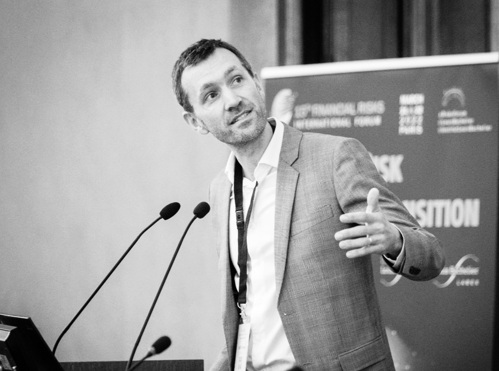

---
---

<link rel="stylesheet" href="styles.css" type="text/css">

I am an associate professor of Finance & Data Science at <a href="https://www.em-lyon.com/en/" target="_blank">em**lyon business school**</a>. My research interests revolve around applications of **numerical methods** in various fields (**financial economics** mostly).  

------  

#### **Academic positions**
Associate Professor of Finance, em**lyon business school** (Sept. 2018 - Present)  
Assistant Professor of Finance, **Montpellier Business School** (Aug. 2015 - Aug. 2018)  
Senior Quantitative Researcher, **EDHEC-Risk Institute** (Apr. 2013 - Jul. 2015)

------   

#### **Education**
Ph.D. in Finance & Applied Mathematics, **ESSEC Business School** & **Université Lille-1** (2008-2012)  
Master of Science in Probability and Finance, **Université Paris-6** (2007-2008)  
Master of Science in Market Finance, **Université Paris-1** (2005-2006)  
Master of Science in Management, **ESSEC Business School** (2002-2007) 

------  

#### **Contact** 
em**lyon business school**   
23, avenue Guy de Collongue  
69130 Ecully FRANCE   
coqueret/at/em-lyon.com  

