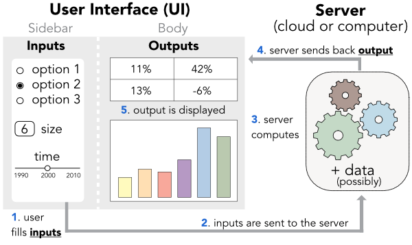

   

Coding dynamic dashboard applications (with R & Shiny)
================
This page contains teaching material for a course on dynamic dashboards.

------------------------------------------------------------------------

Sessions
----

The links below lead to html **slides** and course **material**.

1. Introduction to **R/RStudio** and the **tidyverse** (tidying with tidyr, wrangling with dplyr): <a href="files/shiny/S1_tidyverse.html" target="_blank">**slides**</a> and sample notebook in <a href="files/shiny/notebook_options.Rmd" target="_blank">**RMarkdown**</a> or in <a href="files/shiny/notebook_options.html" target="_blank">**html**</a>

2. **Basic R instructions** (matrices, dataframes, indexing, data modes): <a href="files/shiny/S2_base.html" target="_blank">**slides**</a>, <a href="files/shiny/movies_script.Rmd" target="_blank">**sample notebook**</a> and <a href="files/shiny/Tidyverse_exercises_2.Rmd" target="_blank">**exercise notebook**</a>

3. **Plots** (ggplot, gganimate, plotly): <a href="files/shiny/S3_plots.html" target="_blank">**slides**</a> and <a href="files/shiny/S3_exercises.html" target="_blank">**exercises**</a>

4. **Shiny 1** (User Interface & Server dialog): <a href="files/shiny/S4_ui_server.html" target="_blank">**slides**</a> and <a href="files/shiny/S4_exercises.html" target="_blank">**exercises**</a>. More importantly: the <a href="files/shiny/steps4.zip" target="_blank">**examples**</a>.

5. **Shiny 2** (User Interface layout): <a href="files/shiny/S5_UI_layout.html" target="_blank">**slides**</a> and <a href="files/shiny/S5_exercises.html" target="_blank">**exercises**</a>. More importantly: the <a href="files/shiny/steps5.zip" target="_blank">**examples**</a>.

6. **Shiny 3** (Further options & deployment): <a href="files/shiny/S6_deploy.html" target="_blank">**slides**</a> and more importantly: the <a href="files/shiny/steps6.zip" target="_blank">**examples**</a>.  

7. **Geocomputing, Twitter data & simple text mining**: <a href="files/shiny/geocomputing.nb.html" target="_blank">**notebook for maps**</a> and <a href="files/shiny/Twitter_text.nb.html" target="_blank">**notebook for Twitter text analysis**</a> + <a href="files/shiny/Geocomputing.zip" target="_blank">**all files**</a>  for the maps.

8. **Modelling** & **case study**: <a href="files/shiny/S8.zip" target="_blank">**all files (zipped)**</a>.

---------

Datasets
----

The datasets used in the course: <a href="files/shiny/songs.RData" target="_blank">**songs**</a>, <a href="files/shiny/movies.RData" target="_blank">**movies**</a> and <a href="files/shiny/olympics.RData" target="_blank">**olympics**</a>. Don't forget to locate them in the app/notebook directory.

-----

Resources
----

<a href="https://mastering-shiny.org" target="_blank">**Mastering shiny**</a>: Hadley Wickham's book.

<a href="https://shiny.rstudio.com/tutorial/" target="_blank">**Shiny tutorials**</a>: efficient material (by RStudio).

<a href="https://rstudio.github.io/shinydashboard/" target="_blank">**Shiny dashboard**</a>: the package's webpage.

------------------------------------------------------------------------

**DISCLAIMER**: the data and code are meant for pedagogical use only. 

------------------------------------------------------------------------

